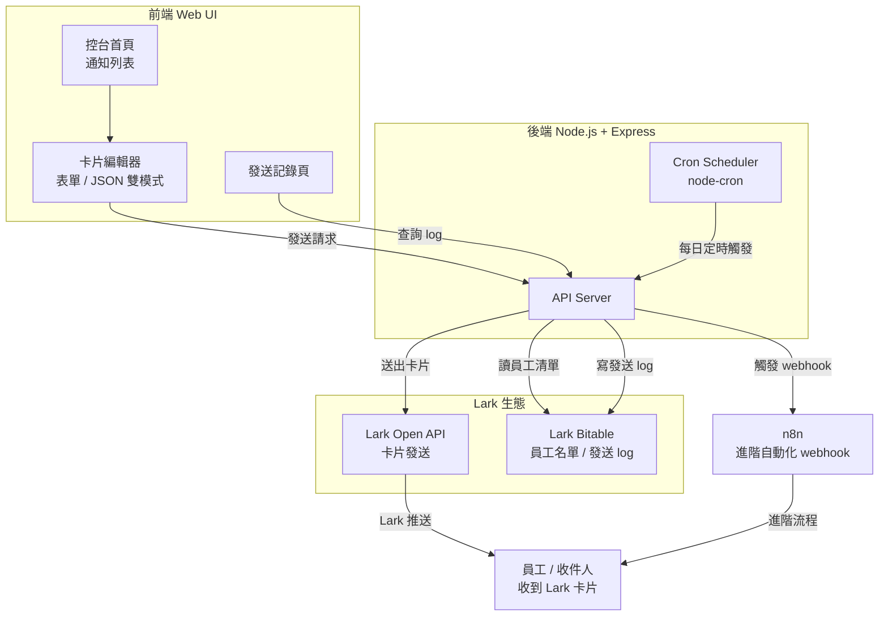

# 自動化通知控台 — 架構流程圖

## 系統架構

## 資料流說明

| 操作 | 路徑 |
|------|------|
| HR 手動發送 | 前端 → API Server → Lark API → 員工 |
| 活動通知（含 webhook）| 前端 → API Server → n8n → Lark API → 員工 |
| 生日卡自動排程 | Cron 10:00 → 讀 Bitable 生日欄位 → Lark API → 員工 |
| 發送記錄查詢 | 前端 → API Server → Bitable |

## 部署說明

- **平台**：Render（Web Service，Node.js）
- **啟動指令**：`npm start`
- **環境變數**：Bot 憑證、Session secret、登入密碼均存於 Render 環境變數，不進 git
- **自動部署**：push 到 main branch 即觸發重新部署
