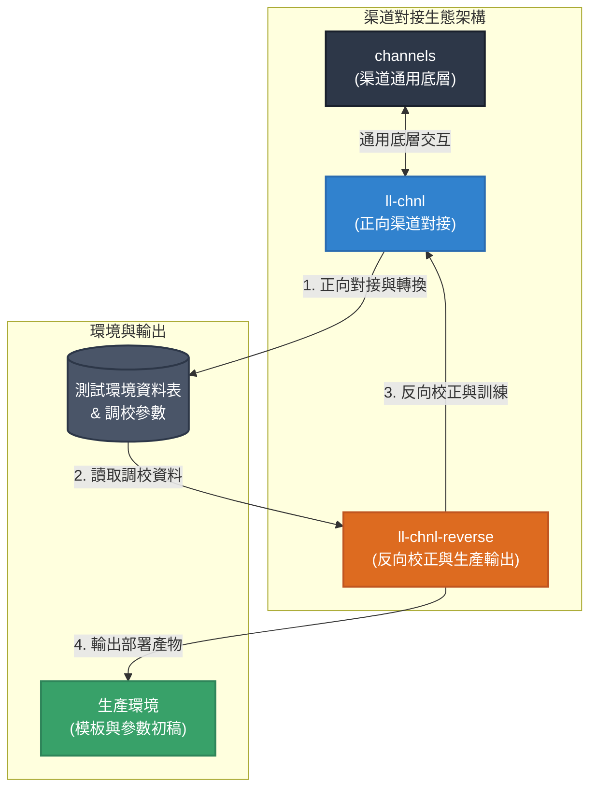

# 樂力專案 — AI 工作流導入現況

本文件彙整樂力各專案導入 AI 工作流的現況，依「渠道對接」、「既有專案維運」、「AI 客服機器人」三大主軸，分述各專案的定位、工作流程、使用工具、主要挑戰與導入心得。

---

## 一、渠道對接相關專案

### 專案說明

- **`channels`（渠道通用底層）**
  - **定位**：核心基礎建設（既有 Java Spring 專案）。
  - **職責**：處理渠道通用的底層交互邏輯，提供穩定、標準化的傳輸與通訊基礎。

- **`ll-chnl`（正向渠道對接）**
  - **定位**：業務對接與資料轉換核心。
  - **職責**：讀取需求（Issue）並分析渠道對接文檔，對接渠道接口，產出資料轉換模板（Mapping Templates）與相關配置參數。

- **`ll-chnl-reverse`（反向校正與生產輸出）**
  - **定位**：資料反向工程與品質保證工具。
  - **職責**：讀取測試環境中調校完成的資料表與參數，反向生成渠道模板與 SQL 參數腳本。其核心價值在於反向校正並訓練 `ll-chnl` 的準確度，同時產出上生產環境（Production）所需的模板與參數初稿。

### 專案關係與架構

三者定位清晰，共同構成「底層交互 → 正向對接 → 反向校正與生產輸出」的閉環生態。

### AI 工作流

1. `ll-chnl` 由 GitLab Issue 讀取開發需求。
2. 讀取本地或線上的渠道開發文檔，分析後彙整為統一格式的渠道規格文檔。
3. 依 Skill 指示產出報文轉換模板與參數（含 SQL 與說明）。
4. 視需要參考或修改 `channels` 中的程式碼。
5. 配置至測試環境。
6. 通過 OP 測試、校正與驗證後，由 `ll-chnl-reverse` 產出符合生產標準的模板與參數初稿，作為上線部署依據。

### 使用工具

- **AI Agent**：Claude Code
- **AI Agent Skills**：vibe-sdlc*（系列）、analyze-channel-api、analyze-channel-dev-requirement、channel-dev、git-workflow、run-sql、ll-kibana、ast-grep、agent-browser、playwright-cli

### 主要挑戰

- 需整合跨專案的邏輯關係、系統渠道規格、開發需求，以及外部渠道接口與規格。
- 分析渠道對接文檔時，常面臨文檔不清或不全、線上文檔過於繁雜，甚至需登入授權才能存取的問題。

### 心得

- 從渠道對接文檔分析出發，產出正規化的渠道開發規格。
- 對接渠道前先預先分析 `channels`（既有 Java 專案），並指示可參考的渠道項目與修改重點。

---

## 二、樂力既有專案

### 專案說明

- **`multipay` 系列專案**
  - **定位**：樂力主要專案集（Java Spring / 既有專案）。
  - **職責**：依需求對樂力系統的核心服務、後端與前端進行增修或優化。

### AI 工作流

1. 由 AI 從 GitLab Issue 接單。
2. 告知修改重點，以及可能或主要的目標程式碼位置、需參考的文件。
3. AI 依需求與提示修改程式碼。
4. 提交審查並校驗。
5. OP 人工測試。

### 使用工具

- **AI Agent**：Claude Code、Antigravity IDE
- **AI Agent Skills**：vibe-sdlc*（系列）、git-workflow、ll-kibana、multipay-add-txn-type、design-doc-mermaid、spring-mvc-refactor-kit

### 主要挑戰

- 既有專案集龐大複雜，不易定位需修正的目標程式碼。

### 心得

- 先做一次完整分析：分析前列出所有相關專案，說明各專案的定位與負責內容，讓 AI 依序分析，並為每個專案產出固定格式的分析文件。
- 讓 AI 分析並生成索引文件，以快速定位目標文件與程式碼。
- 測試流程仍可優化，期望能自動佈署至測試環境，再由 AI 進行測試，取代部分 OP 測試工作。
- 針對常見的修改定義專屬 skill，直接說明重點程式碼位置與修改重點。

---

## 三、樂力 AI 客服機器人

本專案旨在解決樂力運營的客服問題，提供「查單」、「催單」、「不明單查單」等客服功能，並兼具運營助理角色。

### 專案說明

- **`agent-container`**
  - **定位**：AI Agent / TG Bot 佈署容器。
  - **職責**：以 OpenClaw 為基底，建構 TG Bot 相關插件與技能，佈署 Agents 並橋接 TG Bot。

- **`icpay-tg-bot-services`**
  - **定位**：AI Agent 使用的業務服務。
  - **職責**：經由安全驗證機制提供必要的樂力業務服務，並包裝成 skill 供 AI Agent 使用。

- **`icpay-ai-bot-crm`**
  - **定位**：AI 客服機器人智能體框架（Harness）。
  - **職責**：透過預先定義的工作流（狀態機）控制客服對話流程。LLM 僅負責理解與分析目標對象的對話內容（NLU），生成制式格式的 Response，並將意圖轉換成特定事件，以推進下一步工作流程。

### 開發構想

評估兩個方向：

1. 以通用智能體框架（OpenClaw / Hermes）為主。
2. 自建 Harness 框架，嚴格控制業務流程。

| 決策點 | 自建 Harness 框架 | 自建 Harness 特徵 | 通用框架（OpenClaw / Hermes Agent） |
|--------|------------------|------------------|--------------------------------------|
| 主流程驅動 | 狀態機（transitions 庫） | ✅ 確定性、自有 | LLM Agent 自主規劃下一步 |
| LLM 輸出處理 | 翻譯層 + JSONLogic 規則 | ✅ 結構化、可審計 | LLM 直接決定 action |
| 工具暴露 | 自建 LLM 專屬 API 層 | ✅ 受控、白名單 | 將現有 API 直接餵給 Agent |
| 業務規則 | 規則表 + 程式守衛 | ✅ 業務邏輯獨立 | 塞進 Prompt 讓 LLM 判斷 |
| 流程編排 | 狀態轉換表 | ✅ 顯式、可驗證 | Agent 的 reasoning chain |
| 人工介入 | HITL 狀態（Await*） | ✅ 第一等公民 | 框架附加功能（或無） |

### 主要挑戰

- 樂力客服業務邏輯複雜，且觸發詞相近；即使正確區分觸發詞意，後續流程仍變化多端，導致業務流程難以滿足運營需求。

### 心得

- 通用智能體框架方向：需求應由簡至繁，循序迭代。
- 自建 Harness 框架方向：定義強邏輯的工作流（狀態機），確保每個流程步驟均可確定、可驗證。
- 整體取向：本次客服專案因流程確定性要求高，適合把「控制流程」從 LLM 抽離、釘進確定性的程式碼（自建 Harness）以確保可控；惟此並非唯一解——Claude Code「動態規劃 ＋ 落地為確定性程式碼」的混合式思路同樣值得借鏡，宜依專案性質與場景彈性選擇。

> 值得一提的是，Anthropic 於 2026 年 5 月釋出的 Claude Code「Dynamic Workflow」也採用了相同的核心設計原則：將整體**控制流程從 LLM 手中抽離，改由確定性的程式碼負責編排**，LLM 僅承擔有邊界的執行與認知工作。這代表業界領先的 AI 工程實踐，正與我們自建 Harness、以強邏輯狀態機確保「每個流程步驟均可確定、可驗證」的方向不謀而合——印證此方向不僅可行，更是面對複雜業務流程、降低不確定性的主流選擇。
