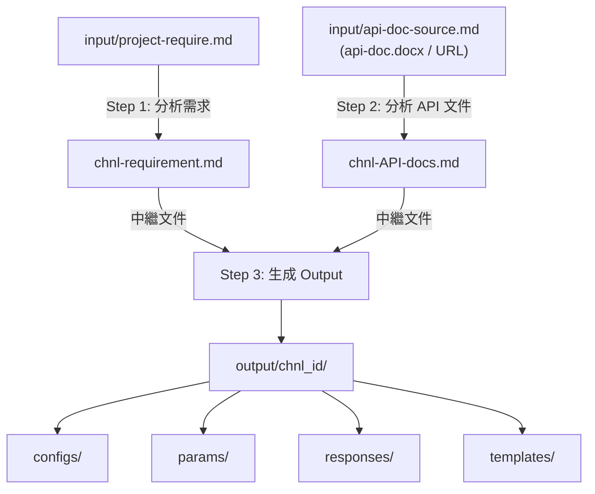

# 渠道開發技能

## 前置確認

使用者觸發此技能時，依提供的資訊分為以下情境：

### 情境 A：使用者提供了渠道專案目錄名稱（例如 `FX-WTpay`）

1. 檢查該目錄是否存在。**若目錄不存在，則自動建立**渠道專案目錄及 `input/` 子目錄。
2. 檢查 `input/` 下是否已有 `project-require.md` 與 `api-doc-source.md`。
3. **若兩個檔案都已存在** → 直接進入工作流程（Step 1 開始）。
4. **若缺少其中一個或兩個** → 提示使用者補充缺少的來源資訊：
   - 缺 `project-require.md` → 請提供**原始需求來源**（本地文件、網頁 URL、或 GitLab/GitHub Issue URL）
   - 缺 `api-doc-source.md` → 請提供 **API 文件來源**（本地文件路徑或 API 文檔 URL，可多個）

### 情境 B：使用者未提供目錄名稱，但直接給了來源資訊

詢問使用者 **渠道編號** 與 **渠道名稱**（若尚未確定）。確認後自動建立渠道專案目錄（`<渠道編號>-<渠道名稱>/`）及 `input/` 子目錄，並將來源資訊寫入 `input/project-require.md` 與 `input/api-doc-source.md`，再進入工作流程。

### 情境 C：使用者什麼都沒提供

詢問使用者：

> 請提供以下任一資訊：
> 1. **渠道專案目錄名稱**（例如 `FX-WTpay`），我將檢查該目錄下的 `input/` 是否已有需求與 API 文件來源。
> 2. 或者分別提供：
>    - **原始需求來源**：本地文件路徑、網頁 URL、或 GitLab/GitHub Issue URL
>    - **API 文件來源**：本地文件路徑或 API 文檔 URL（可多個）
>
> 另外請提供 **渠道編號** 與 **渠道名稱**（若尚未確定）。

收到資訊後，若渠道專案目錄尚未存在，則自動建立渠道專案目錄（`<渠道編號>-<渠道名稱>/`）及 `input/` 子目錄，再依情境 A 或 B 的邏輯繼續處理。

---

## 技能目標

給定一個渠道的 `input/` 目錄（或透過前置確認取得的來源資訊），執行完整的渠道對接分析，最終生成 `output/<chnl_id>/` 下所有必要檔案：

```
output/<chnl_id>/
├── configs/
│   ├── <chnl_id>-config.md      # Channel Service Config（表格 + JSON）
│   └── <chnl_id>-config.sql     # SQL INSERT 語句（REPLACE INTO tbl_chnl_service_conf）
├── params/
│   ├── <chnl_id>-params.md      # Channel Params（表格）
│   └── <chnl_id>-params.sql     # SQL INSERT 語句（REPLACE INTO tbl_mer_params）
├── responses/
│   ├── <chnl_id>-translate.md   # 狀態碼對照表（表格）
│   └── <chnl_id>-translate.sql  # SQL INSERT 語句
└── templates/
    ├── <chnl_id>-templates.md   # 模板清單說明
    ├── <chnl_id>-templates.sql  # SQL INSERT 語句（REPLACE INTO tbl_chnl_templates）
    └── templates/               # FreeMarker 模板檔案（*.ftl）
        ├── txn_req.ftl
        ├── txn_req_sign.ftl
        ├── txn_req_header.ftl   # 若有 Header 認證
        ├── txn_sync_resp.ftl
        ├── txn_sync_resp_sign.ftl   # 通常為空文件
        ├── txn_notify.ftl
        ├── txn_notify_sign.ftl
        ├── txnQry_req.ftl
        ├── txnQry_req_sign.ftl
        ├── txnQry_req_header.ftl
        ├── txnQry_resp.ftl
        ├── txnQry_resp_sign.ftl
        ├── 5210_txn_req.ftl     # 代付系列（模板名稱冠 5210_）
        ├── 5210_txn_req_sign.ftl
        ├── 5210_txn_req_header.ftl
        ├── 5210_txn_sync_resp.ftl
        ├── 5210_txn_sync_resp_sign.ftl  # 通常為空文件
        ├── 5210_txn_notify.ftl
        ├── 5210_txn_notify_sign.ftl
        ├── 5210_txnQry_req.ftl
        ├── 5210_txnQry_req_sign.ftl
        ├── 5210_txnQry_resp.ftl
        └── 5210_txnQry_resp_sign.ftl
```

---

## 名詞定義

| 術語 | 說明 |
|------|------|
| 渠道 / 上游 | 支付方式的供應商，提供收款/付款能力 |
| 小商戶 / 下游 | 使用我方平台的客戶 |
| chnl_id / 渠道編號 | 我方系統定義，用來區別不同渠道（如 FX、FY） |
| merId / 客戶編號 | 我方賦予小商戶的帳戶編號 |
| chnlMerId / 大商編 | 渠道方提供給我方的商戶編號，通常即為渠道的「商戶號」 |
| chnlOrderId / 渠道訂單號 | 我方生成的訂單號，用於向渠道發起請求及查詢 |
| 交易類型 (txn_type) | 4 碼編號，前 2 碼為主交易類，後 2 碼為子類（如 0121、5210） |
| 0010 | 代收查詢（訂單狀態查詢，代收類） |
| 0050 | 代付查詢（訂單狀態查詢，代付類） |
| 0121 / 012? | 代收支付（跳轉類 / 掃碼類 / H5 類） |
| 5210 / 52xx | 代付（出金）交易 |
| PayMode | 系統交互模式類，決定 HTTP 發送方式與生命週期 |
| ext_config | 渠道服務配置 JSON，控制簽名/報文格式/模板等行為 |
| tbl_chnl_service_conf | 渠道服務配置表（config） |
| tbl_mer_params | 商戶參數表（params），存放 URL、密鑰、簽名開關等 |

---

## 參考文件索引與使用時機

本技能依賴 `reference/sys-docs/` 下的系統文檔。**不要等遇到問題才查**，下表標明每個文檔的觸發時機，請在對應步驟主動查閱：

| 觸發時機 | 應查文件 | 用途 |
|---|---|---|
| **Step 3.1 決定 svc_addr / svc_interactive / svc_invoke 前** | `reference/sys-docs/api-docs/*-seq-diagram.md`（PayV3Mode1/Mode2、PayV5Mode1） | 確認交互時序與適用場景，避免選錯 PayMode |
| **Step 3.1 ext_config 涉及非標準簽名邏輯（自訂排序、特殊拼接、欄位代換）** | `reference/sys-docs/api-docs.md §六、安全簽名機制（Security）` | 評估標準 SignatureV2ForMap/ForJson 是否夠用；不夠則需自訂類 |
| **Step 3.2 撰寫 params 涉及參數讀取優先級疑問** | `reference/sys-docs/api-docs/com/icpay/payment/common/utils/ChnlBaseTools-docs.md`（`參數配置讀取` 章節） | 釐清 mchnt_cd × param_cat 匹配優先級 |
| **Step 3.4 撰寫模板需用 `svc.*` 方法但不確定簽名/用法** | `reference/sys-docs/api-docs.md §四、渠道基礎類別` 與 `ChnlBaseTools-docs.md` | 取得方法簽名、回傳型別、使用範例 |
| **Step 3.4 模板需 `rand.*` 方法（必填欄位無業務值時）** | `reference/sys-docs/api-docs/com/icpay/payment/common/utils/RandomUtils-docs.md` | 完整 rand 方法清單與參數說明 |
| **Step 3.4 涉及金額/編碼轉換、雜湊、Base64 等** | `reference/sys-docs/api-docs/com/icpay/payment/common/utils/{Converter,EncryptUtil,Utils}-docs.md` | 工具類完整 API |
| **新渠道、不熟悉系統架構時** | `reference/sys-docs/api-docs.md`（首頁索引） | 從索引總覽各類別與時序圖位置 |

> **原則**：寧可花 1 分鐘查文檔，避免後續模板/配置寫錯需返工。優先查文檔再做決策，而非依記憶或猜測。

---

## 工作流程



---

## Step 1：分析需求 → `<chnl>-requirement.md`

使用 /analyze-channel-dev-requirement skill，讀取 `input/project-require.md`，輸出結構化需求文件，放於範例目錄的根層（與 input/ 同層）。

輸出應包含：
- 任務摘要表（txn_type / 類型 / 幣別 / 關鍵規格）
- 基本資訊（渠道編號、名稱、是否支持反查、回調 IP）
- 各交易類型詳細需求（URL、是否需要自訂收銀台、金額是否浮動）
- 商戶資料（mchnt_cd、密鑰、後台地址）
- 接口 URL 配置
- 待確認事項

> 上面所謂的「自訂收銀台」，指的是需要我們自己設計收銀台，而不使用上游(渠道)提供的收銀台。因此需要上游響應能夠讓用戶支付所需的必要資訊（例如：轉入 ）

---

## Step 2：分析 API 文件 → `<chnl>-API-docs.md` + 範例程式碼

使用 /analyze-channel-api skill，讀取 `input/api-doc-source.md`（內含API文件的 URL 或本地文件路徑），輸出 API 分析文件，放於與 input/ 同層。

具體步驟都在 /analyze-channel-api 技能中有規範。

> **⚠️ 重要警告（避免重蹈覆轍）**：
> - **禁止**直接啟動 general-purpose subagent 搭配 WebFetch 抓取 API 文件。此做法會繞過 analyze-channel-api 技能規定的 agent-browser 標準流程，導致 `input/api-doc-urls.md` 未被建立，且多頁文件站的子頁面可能遺漏。
> - API 文件來源為 URL 時，**第一步必定是 `/agent-browser open <url>`** 截圖並提取所有導覽連結，儲存至 `input/api-doc-urls.md`，再逐一擷取每個子頁面。
> - analyze-channel-api 技能中的 URL 擷取步驟不可省略，即使「預估文件內容已知」也不行。

### Step 2.5：生成 API 範例程式碼（不可省略）

**此步驟為必要步驟，不可跳過。** 即使 Step 2 委派給背景 agent 執行，也必須確認範例程式碼已生成。若 agent 未產出，需在 agent 完成後補生成。

依照 analyze-channel-api 技能的「步驟5」規範，生成 Python 語言的範例程式碼：

**輸出目錄**：`<渠道目錄>/<渠道名>-API-examples/`

**必須包含的檔案**：

| 檔案 | 說明 |
|------|------|
| `common.py` | 通用模組：簽名計算、配置載入、驗簽、回應列印 |
| `deposit.py` | 代收下單範例（若有代收需求） |
| `withdraw.py` | 代付下單範例（若有代付需求） |
| `query_order.py` | 訂單查詢範例 |
| `callback_handler.py` | 回調處理範例（Flask 服務） |
| `.env.example` | 環境變數範本（含 BASE_URL、商戶號、密鑰等） |
| `README.md` | 使用說明（環境準備、程式碼清單、使用方法、簽名算法說明） |

**要求**：
- 接口地址與參數值不得寫死，應從 `.env` 配置讀取
- 簽名計算邏輯必須與 API 文件一致（排序、拼接、密鑰附加方式、雜湊算法）
- 每個範例需包含 `__main__` 區塊，可直接執行測試

---

## Step 3：生成 Output

基於 需求文件 {channel}-requirement.md 與 API文檔 {channel}-API-docs.md，逐一生成以下四類輸出。

**輸出格式原則（重要）**：

- **`*.md`（configs / params / responses / templates 下的 md）為純資料呈現** — 標題 + 表格，或逐 `chnl_id`/`txn_type` 列 `ext_config` JSON。**不要寫**設計理由、簽名邏輯說明、TODO、聯調注意事項、保守處理理由等說明性內容。
- 設計理由、保守處理原因、聯調 TODO、未確認事項等寫進 `<chnl>-requirement.md`（Step 1 產出），不要污染資料 md。
- **`*.sql` 不含任何 `-- ...` 註解**（包含檔頭的「對應系統表」「Channel Service Config」等說明），只保留 `REPLACE INTO ... VALUES ...` 主體。SQL 是要進 DB 的純資料，不是文檔。

---

### 3.1 Channel Config → `configs/<chnl_id>-config.md` + `.sql`

**Config 表欄位**（`tbl_chnl_service_conf`）：

| 欄位 | 說明 |
|------|------|
| chnl_id | 渠道編號 |
| txn_type | 交易類型（0010 / 0050 / 0121 / 5210 等） |
| chnl_svc_type | 固定 `JAR` |
| svc_addr | PayMode 類全名（見下方決策表） |
| svc_interactive | 交互模式：`Sync` / `Redirect` / `Async` |
| svc_invoke | 啟動方法：`query`（查詢） / `convRequest`（代收/代付，**90% 場景的預設**）/ `commonTrans`（罕見的多步互動流程）/ `convResult`（**0098 反查回調專用**） |
| bypass_chnl_http_status | 固定 `1` |
| allow_notify | 固定 `1` |
| svc_state | 固定 `1` |
| jar_file_name | 通常留空 |
| protocol_ver | 固定 `1` |
| tags | 通常留空 |
| ext_config | JSON，見下方 ext_config 說明 |
| memo | 備註（如「注意模板名称需冠 5210_」） |

**PayMode 選擇決策表**：

| txn_type | 場景 | svc_addr | svc_interactive | svc_invoke |
|----------|------|----------|-----------------|------------|
| 0010 | 代收訂單查詢 | `PayV5Mode1`（可能有 Header 簽名） | `Sync` | `query` |
| 0050 | 代付訂單查詢 | `PayV3Mode2` | `Sync` | `query` |
| 0121 / 014x | 代收（**任何由我方產生跳轉 URL 的場景**：上游回 payUrl / 我方自製收銀台 / QR Code 渲染） | `PayV5Mode1` | `Redirect` | **`convRequest`** |
| 0121 / 014x | 代收（罕見：用戶需在我方頁面持續多步互動，例如多次表單操作） | `PayV5Mode1` | `Redirect` | `commonTrans` |
| 0121 | 代收（直接返回結果，無跳轉） | `PayV5Mode1` | `Async` | `convRequest` |
| 5210 | 代付 | `PayV3Mode2` | `Async` | `convRequest` |
| **0098** | **渠道反查回調**（上游建單後回調我方確認訂單存在） | **`PayV3Mode1`** | **`Async`** | **`convResult`** |

> 選擇原則：
> - 範例中可能有使用到 V1~V5 系列(沒有V4)，高的版本是由上一個版本新增擴充而來，因此通常相容於舊的版本，因此原則是選新不選舊，但是目前因為沒有 `PayV5Mode2`因此若需 Mode2 則選 `PayV3Mode2` 。
>
> - 支付類選 Mode1 系列，代付選 Mode2 系列。
>
> - svc_addr 基本選擇最新的，也就是 `PayV5Mode1` 與 `PayV3Mode2`
>
> - **`convRequest` 是 90% 代收場景的預設**：只要「我方產生跳轉 URL」（含上游給 payUrl、我方自製收銀台、QR Code 渲染收銀台）都選 `convRequest`，**不要因為「展示 QR Code」就誤選 commonTrans**。
>
> - **`commonTrans` 適用於罕見的多步互動**（用戶需在我方頁面持續操作），一般渠道用不到。
>
> - **`convResult` 是 0098 反查回調專用**（上游 → 我方）的啟動方法，搭配 `PayV3Mode1`。
>
>   


**ext_config 欄位說明**：

```jsonc
{
    "requestMode": "JSON_JSON",     // 請求/響應格式：JSON_JSON 或 FORM_JSON
    "notifyMode": "JSON",           // 異步通知格式：JSON 或 FORM
    // "chnlReqMethod": "POST",     // 僅在需要覆蓋預設 HTTP 方法時才加（通常不需要）
    "useTemplateForRequestHeader": "1",  // 是否用模板設定 Request Header（有 Bearer Token 設 1）
    // "useTemplateForQueryHeader": "1", // 僅在查詢接口也有 Header 模板時才加（通常不需要）
    "templateNamePrefix": "",       // 模板前綴：代收用 ""，代付用 "5210_"
    "signConnector": "&",           // 簽名欄位間的連接符
    "keyValConnector": "=",         // key=value 的連接符（signWithFieldName=false 時設 ""）
    "keyConnector": "",             // 密鑰前綴連接符：無連接符用 ""，有用 "&key="
    "signatureKeyField": "",        // 通常留空
    "removeEmptyForSign": "true",   // 簽名時排除空值欄位（見下方規則）
    "signWithFieldName": "true",    // 簽名含欄位名稱（false = 純值拼接）
    "sortMessageForSign": "true",   // 依 ASCII 排序後簽名
    "signatureUpper": "false",      // MD5 結果是否大寫
    "urlEncode": "0",               // URL 編碼
    "binaryEncoding": "HEX",        // 簽名二進制編碼（HEX 或 BASE64）
    "keyEncoding": "HEX",           // 密鑰編碼
    "signAlgorithm": "MD5",         // MD5 / SHA256 / MD5_KeyFront_connector（密鑰前置）/ RSA 等
    "signatureService": "com.icpay.payment.service.channel.common.sec.SignatureV3ForMap"
    // 簽名服務：Map 格式用 SignatureV3ForMap，JSON 格式用 SignatureV3ForJson（預設 V3；V3 向下相容 V2）
}
```

> `requestMode` 決策：
> - 格式：{請求格式}_{響應格式}，如 `JSON_JSON`、`FORM_JSON`（請求 Form，響應 JSON）等
> - 渠道接收 JSON body，響應 JSON body → `JSON_JSON`
> - 渠道接收 Form（`application/x-www-form-urlencoded`），響應 JSON body → `FORM_JSON`

> `keyValConnector` 決策：
> - `signWithFieldName: true`（key=value 格式簽名）→ `"keyValConnector": "="`
> - `signWithFieldName: false`（純值拼接，無 key=value）→ `"keyValConnector": ""`（空字串）

> `keyConnector` 決策（密鑰附加方式）：
> - 密鑰直接拼接在末尾（無分隔符）→ `"keyConnector": ""`
> - 密鑰以 `&key=` 前綴拼接在末尾 → `"keyConnector": "&key="`
> - 密鑰拼接在「最前面」（如 `MD5(KEY + "&" + body)`）→ `"keyConnector": "&"` 搭配 `"signAlgorithm": "MD5_KeyFront_connector"`（需用 V3 系列 signatureService）

> `removeEmptyForSign` 規則，依渠道API文件決定空值是否納入簽名：
> - 空值納入簽名（如 `username="Mike"`, `password=""`）→ `"false"`（保留空值），則拼接字符串為 `username=Mike&password=`
> - 空值不納入簽名（如 `username="Mike"`, `password=""`）→ `"true"`（排除空值），此時會在 *_sign.ftl 模板輸出後，轉換成map時自動過濾掉值為空的欄位，則拼接字符串為 `username=Mike`（password 欄位被排除）

> `chnlReqMethod` ： 默認(省略時)為 `POST`，可能的值有 `POST`、`GET` 等。

> `useTemplateForQueryHeader`： 默認(省略時)為 `false`，即查詢接口不使用 Header 模板。僅當查詢接口也需要特殊 Header（如 Bearer Token）時，才設 `useTemplateForQueryHeader: "true"`，並提供對應的 `txnQry_req_header.ftl` 模板。

> `signatureKeyField`： 當賦值時，在計算簽名原始報文時，會將密鑰代入該欄位。
> - 一般而言使用拼接類(key=value)簽名時通常留空(因為密鑰通常拼接在最後)。
> - 僅在某些情況下，例如以JSON格式進行簽名時需要將密鑰納入特定字段，或當簽名服務需要從報文中取特定欄位作為密鑰（如某些 RSA 方案）時，才填入該欄位名稱。

> `signatureService` 決策：
> - 簽名前所有報文字段會存放在 Map 中傳給簽名服務，簽名服務依相關配置組裝簽名原始內容（通常為字符串），再依 `signAlgorithm` 計算摘要。
> - **新渠道一律優先用 V3 系列**（`SignatureV3ForMap` / `SignatureV3ForJson`）：
>   - **V3 完全向下相容 V2** — 凡 V2 能處理的場景（標準 MD5/SHA256 拼接），V3 都能正確處理，行為一致。
>   - V3 額外註冊新演算法（如 `MD5_KeyFront_connector`）與更彈性的編碼選項（如 `keyEncoding: RAW`）。
>   - 既有渠道用 V2 是「歷史包袱」（V2 時代產物），不代表 V2 比較好 — 新對接時不要被 prod 的 V2 配置誤導。
> - 對應的服務類：
>   - Map 拼接（`key1=value1&key2=value2` 或 `value1|value2|`）→ **`SignatureV3ForMap`**
>   - JSON 格式字符串 → **`SignatureV3ForJson`**
>   - 全名前綴：`com.icpay.payment.service.channel.common.sec.`
> - **`signatureService` 與 `signAlgorithm` 必須成對**：
>   - `"MD5"` / `"SHA256"`：V2 / V3 皆可（用 V3 即可）
>   - `"MD5_KeyFront_connector"`（密鑰前置 + 可配置連接符）：**僅 V3 系列註冊**，配 V2 會在運行時拋 `不合法的签名演算法`
> - 若有特殊簽名需求（自訂排序、特殊拼接、欄位代換），先查 `reference/sys-docs/api-docs.md §六、安全簽名機制` 與 `SignatureProxy*-docs.md`；標準類不夠才考慮自訂類，並在此處配置自定義類的全名。

---

### 3.2 Channel Params → `params/<chnl_id>-params.md` + `.sql`

**Params 表（`tbl_mer_params`）**：

| 欄位 | 說明 |
|------|------|
| chnl_id | 渠道編號 |
| mchnt_cd | 商戶碼：`*`=所有商戶，`#DEFAULT#`=預設，`{mchnt_cd}`=特定商戶 |
| param_cat | 類別：`*`=全交易類，`PARAM`=通用開關，`SEC`=密鑰，或具體 txn_type，或自訂其它分類 |
| param_id | 參數名稱 |
| param_value | 參數值 |
| orderSeq | 固定 `100` |
| param_desc | 說明 |
| param_st | 固定 `1` |


取值時，會優先匹配具體商戶碼（`{mchnt_cd}`）和具體交易類（如 `0121`），其次匹配全商戶（`*`）和具體交易類，最後匹配全商戶全交易類（`*` + `*`）。因此在配置參數時，請根據需要覆蓋的範圍，選擇合適的 mchnt_cd 和 param_cat。

報文轉換模板(Freemarker)中，可透過 svc.getMerParam('param_id', 'default_value') 來取值，系統會自動根據上述優先級規則返回對應的參數值。 具體可參考 文件 reference/sys-docs/api-docs/com/icpay/payment/common/utils/ChnlBaseTools-docs.md 中的章節 `Class: ChnlBaseTools` -> `參數配置讀取` 。


**必填的通用參數**：

| mchnt_cd | param_cat | param_id | param_value | 說明 |
|----------|-----------|----------|-------------|------|
| `#DEFAULT#` | `PARAM` | `notify.sync.resp` | `ok` 或 `SUCCESS`（依渠道要求） | 異步通知回覆內容 |
| `*` | `*` | `casher.timeout` | `300` | 收銀台有效期（秒），所有使用 PaymentWithCasherImpl 的渠道必填 |
| `*` | `*` | `sign.field.name` | `sign` | 簽名欄位名稱 |
| `*` | `*` | `sign.field.ignore.names` | `channelId,intTxnType,refId` | 簽名忽略欄位（不參與簽名的系統欄位） |
| `*` | `*` | `url.txn.req` | 代收請求 URL（以 API 文件為準） | 代收接口地址 |
| `*` | `*` | `url.txn.query` | 代收查詢 URL（含 `${chnlOrderId}`） | 代收查詢接口地址 |
| `*` | `0050` | `url.txn.query` | 代付查詢 URL | 代付查詢接口地址 |
| `*` | `5210` | `url.txn.req` | 代付請求 URL | 代付接口地址 |
| `*` | `PARAM` | `sign.action.req.sign` | `1` | 請求報文是否需要簽名 |
| `*` | `PARAM` | `sign.action.resp.check` | `0`（可能不驗簽同步響應） | 響應報文是否驗簽 |
| `*` | `PARAM` | `sign.action.resp.check.by.template` | `0` | 響應驗簽是否使用模板 |
| `*` | `PARAM` | `sign.action.notify.check` | `1` | 異步通知是否驗簽 |
| `*` | `PARAM` | `sign.action.notify.check.by.template` | `1` | 異步通知驗簽是否用模板 |
| `*` | `PARAM` | `sign.action.qry.sign` | `1` 或 `0`（依渠道查詢是否需簽名） | 查詢是否簽名 |
| `*` | `PARAM` | `sign.action.qry.check` | `0` | 查詢響應是否驗簽 |
| `*` | `PARAM` | `sign.action.qry.check.by.template` | `0` | 查詢響應驗簽是否用模板 |
| `{mchnt_cd}` | `SEC` | `sign.key` | `senc.v1::...`（加密後密鑰） | 簽名密鑰 |
| `{mchnt_cd}` | `SEC` | `verify.key` | `senc.v1::...`（加密後密鑰） | 驗簽密鑰 |

> **`sign.field.ignore.names` 重要原則**：固定三欄 `channelId,intTxnType,refId` 是系統內部欄位（必須忽略）。**`channel` 視渠道而定** — 若上游 API 自己也用 `channel` 欄位（如 GoldenPay 的 `channel:"bank"` 通道代碼），**禁止加入忽略清單**，否則簽名會缺欄導致驗簽失敗。對接前需檢查 API 文件的請求/通知欄位是否含 `channel`。

> URL 以 API 文件為準（需求文件 URL 可能過期或不準確，請優先使用 API 文件中的 endpoint）。

> 密鑰格式：若是開發/測試環境，密鑰可先填入明文佔位符（如 `(KEY)`），說明「見 email」或「待補」。

**條件性參數**：

| 條件 | mchnt_cd | param_cat | param_id | param_value |
|------|----------|-----------|----------|-------------|
| 代收有要求自製收銀台 | `*` | `0121` | `casher.url` | `http://paygate.dev-ai.org:9090/gateway-onl/casher/casher.{chnl_id_lower}.0121.do` |
| 014x /013x 類型要求自製收銀台 | `*` | `014d`（或具體 txn_type） | `casher.url` | `http://paygate.dev-ai.org:9090/gateway-onl/casher/casher.{chnl_id_lower}.014x.do`（多個類型可能共用同一路徑） |

**渠道指定參數**：

以下是一些範例，實際參數需根據渠道 API 文件分析決定。請根據需求文件和 API 文件，將必要的通道類型參數（如通道類型、查詢類型、Bearer Token 等）加入到商戶參數表中，並在模板中使用 `svc.getMerParam()` 取值。

| 條件 | mchnt_cd | param_cat | param_id | param_value |
|------|----------|-----------|----------|-------------|
| 代收接口需指定通道類型 | `*` | `012b`（或具體 txn_type） | `type` | `{channel_code}`（在模板中用 `svc.getMerParam('type', '')` 取值） |
| 渠道指定代收查詢類型 | `*` | `0010` | `chnl.qryType` | `003` （在模板中用 `svc.getMerParam('chnl.qryType', '003')` 取值）|
| 渠道指定代付查詢類型 | `*` | `0050` | `chnl.qryType` | `001`（在模板中用 `svc.getMerParam('chnl.qryType', '001')` 取值）|
| 有 Bearer Token / API Token（非密鑰型） | `*` | `*` | `apitoken` | `{token值}` （在模板中用 `svc.getMerParam('apitoken', '')` 取值） |


---

### 3.3 Response Translate → `responses/<chnl_id>-translate.md` + `.sql`

主要目的是定義渠道返回的狀態碼或響應碼（src_code）如何映射到我方統一的狀態碼（dest_code），以便系統能夠正確識別交易結果。

我方的狀態碼定義：
- `01` = 處理中
- `10` = 成功
- `20` = 失敗

請注意：
- 一般而言，同步響應只會在處理中或失敗，但失敗必須謹慎判斷。**所有 catalog 的通配 `*` 一律映射為 `01`（處理中）**，絕不允許 `*→20`（不論代收或代付、不論文檔說明，避免上游新增未知碼時被通配吃成失敗）。明確的業務失敗碼才映射 `20`，並逐一列出。真正的成功狀態應由異步通知或查詢結果確認。
- 一般只有在異步通知(回調)或查詢的同步響應中，才有可能有「成功」或「失敗」的狀態。發起請求的同步響應通常只能表示「提交成功」或「提交失敗」，交易狀態應該保留在處理中，真正的交易結果需要等異步通知或查詢結果來確認。
- 交易成功與失敗需要謹慎判斷，需要文檔中明確說明表示交易成功或失敗才能映射，若不是很確定請務必標註說明。
- 交易狀態與響應碼不一定直接對應，需根據渠道 API 文件中的狀態碼說明來判斷。例如，有些渠道可能用 `200` 表示「提交成功，等待處理」，此時應映射為 `01`（處理中），而非 `10`（成功）。
- 若無法確定渠道狀態，請保留在處理中（src_code=`*`, dest_code=`01`），後續可根據實際情況調整。

**表結構（`tbl_chnl_translate` 或類似）**：

| 欄位 | 說明 |
|------|------|
| chnl_id | 渠道編號 |
| class_name | `*` |
| catalog | 狀態碼分類（見下方） |
| src_code | 渠道原始狀態碼 |
| dest_code | 我方統一狀態碼（`10`=成功，`20`=失敗，`01`=處理中） |
| dest_msg | 狀態說明 |
| memo | 備註 |

**Catalog 分類規則**：

| catalog | 適用場景 | wildcard `*` 預設值 | 說明 |
|---------|---------|-------------------|------|
| `PAY_NOTIFY` | 代收異步通知狀態碼 | `01`（處理中） | 成功=10，失敗=20 |
| `PAY_QRY` | 代收訂單查詢狀態碼 | `01`（處理中） | 成功=10，失敗=20 |
| `WITHDRAW` | 代付同步響應狀態碼 | `01`（處理中） | 200=01 提交成功；其他業務失敗碼**逐一列**=20（見下方說明） |
| `WITHDRAW_NOTIFY` | 代付異步通知狀態碼 | `01`（處理中） | 成功=10，失敗=20；需明確定義失敗碼（如 `2 = 20`） |
| `WITHDRAW_QRY` | 代付查詢狀態碼 | `01`（處理中） | 成功=10，失敗=20；需明確定義失敗碼（如 `2 = 20`） |

> **`WITHDRAW` catalog 語義**（代付同步響應）：
> - wildcard `*` = `01`（處理中）。代付同步響應的真正結果應由 `WITHDRAW_NOTIFY` / `WITHDRAW_QRY` 確認，**通配絕不直接判失敗**（避免上游新增未知碼導致誤判賠付）。
> - `200` = `01`（HTTP 200 表示「提交成功，等待處理」）。
> - **明確的業務失敗碼必須逐一映射為 `20`**（如 `400` 通道維護/超限、`406` 餘額不足、`422` 參數錯誤等），不要靠通配吃掉，否則失敗訂單會卡在處理中無法結清。
> - 上線前必查 API 文件「錯誤碼/HTTP 狀態碼」章節，將所有「能立即斷定失敗」的碼補入對照表。

> **`WITHDRAWCODE` catalog**：不是標準 catalog，不應默認加入。若渠道確有特殊錯誤碼映射需求，才考慮加入。

> **規則**：每個 catalog 必須有一條 `src_code = *` 的通配規則，**通配一律 `01`（處理中）**（即使文檔說「除某碼外其他皆為失敗」，也保守通配為 `01`，明確碼才映射 `20`，避免上游新增未知碼時直接判失敗）。`WITHDRAW`、`WITHDRAW_NOTIFY`、`WITHDRAW_QRY` 需加入具體失敗狀態碼（如渠道返回 `2` = 失敗時，加 `2 = 20`）。

---

### 3.4 Templates → `templates/templates/*.ftl`

#### 模板命名規則

| 用途 | 代收（0121） | 代付（5210） |
|------|-------------|-------------|
| 發起請求報文 | `txn_req.ftl` | `5210_txn_req.ftl` |
| 發起請求簽名 | `txn_req_sign.ftl` | `5210_txn_req_sign.ftl` |
| 發起請求 Header | `txn_req_header.ftl` | `5210_txn_req_header.ftl` |
| 發起請求同步響應 | `txn_sync_resp.ftl` | `5210_txn_sync_resp.ftl` |
| 同步響應驗簽 | `txn_sync_resp_sign.ftl`（**通常為空文件**） | `5210_txn_sync_resp_sign.ftl`（**通常為空文件**） |
| 異步通知解析 | `txn_notify.ftl` | `5210_txn_notify.ftl` |
| 異步通知驗簽 | `txn_notify_sign.ftl` | `5210_txn_notify_sign.ftl` |
| 查詢請求報文 | `txnQry_req.ftl` | `5210_txnQry_req.ftl` |
| 查詢請求簽名 | `txnQry_req_sign.ftl` | `5210_txnQry_req_sign.ftl` |
| 查詢請求 Header | `txnQry_req_header.ftl` | `5210_txnQry_req_header.ftl` |
| 查詢響應解析 | `txnQry_resp.ftl` | `5210_txnQry_resp.ftl` |
| 查詢響應驗簽 | `txnQry_resp_sign.ftl` | `5210_txnQry_resp_sign.ftl` |

> `txn_sync_resp_sign.ftl` 和 `5210_txn_sync_resp_sign.ftl`：這兩個文件通常為**空文件**（僅含一個換行），但仍應存在於模板清單中。當 `sign.action.resp.check.by.template` 為 `1` 時，則此模板必須有值，系統會嘗試使用這些模板來驗簽同步響應。
如果文件為空，而且`sign.action.resp.check.by.template` 為 `1`，則表示同步響應驗簽不需要特定模板內容，系統會使用默認的簽名驗證邏輯（通常是將響應報文轉為 Map 後進行驗簽）。如果文件有內容，則系統會先使用模板生成一個字符串，再對該字符串進行驗簽。

> `txnQry_req.ftl`（代收查詢）與 `5210_txnQry_req.ftl`（代付查詢）：若查詢為 GET 並以 URL 變數傳訂單號（如 `/${chnlOrderId}`），模板可留空。

#### FreeMarker 模板撰寫指南

**通用模板規範**：
```ftl
<#-- {模板名稱}： 模板說明 -->
<#setting number_format="0">  <#-- 必加，避免數字科學計數法 -->
```

下列狀況應該在模板開頭設定幣別、金額單位、金額格式：
- 請求報文模板中涉及渠道端金額欄位，則必須使用 `svc.toChnlAmt(ctx.txnAmt)` 進行金額轉換
- 響應報文模板中涉及渠道端金額欄位，則必須使用 `svc.fromChnlAmt(ctx.data.payAmount)` 來轉換回我方金額（`ctx.data.payAmount` 僅為示例，實際字段需根據 API 文件分析決定）

```ftl
${svc.setCurrencyByCode('704')} <#-- 设置交易币别 -->
${svc.setChnlAmtUnitStr('1.0')} <#-- 设置渠道金额的单位:1.0=元 -->
${svc.setChnlAmtFormat('0.00')} <#-- 设置渠道金额的格式化方式 -->
${svc.setLocalAmtFormat('0')} <#-- 设置本地金额的格式化 -->
```

**可用的 Context 變數（`ctx.*`）**：

| 變數 | 說明 |
|------|------|
| `ctx.chnlOrderId` | 我方渠道訂單號（發給渠道的訂單號） |
| `ctx.txnAmt` | 交易金額（我方原始金額，整數分或元，依配置） |
| `ctx.chnlNotifyUrl` | 異步回調 URL |
| `ctx.chnlPageRetUrl` | 支付成功跳轉 URL |
| `ctx.clientIp` | 用戶 IP |
| `ctx.accName` | 收款人姓名（代付用） |
| `ctx.accNum` | 收款帳號（代付用） |
| `ctx.bankNum` / `ctx.chnlBankNum` | 銀行代碼（代付用）。**優先取 `ctx.chnlBankNum`**（渠道專用碼），fallback 到 `ctx.bankNum`（通用碼）。範本寫法：`${ctx.chnlBankNum!ctx.bankNum!''}` |
| `ctx.bankName` / `ctx.chnlBankName` | 銀行名稱（代付用），同上 fallback 原則：`${ctx.chnlBankName!ctx.bankName!''}` |

**可用的 Service 方法（`svc.*`）**：

| 方法 | 說明 |
|------|------|
| `svc.getChnlMerId()` | 取渠道商戶號（優先使用此方法，不要用 `ctx.merchantNo`） |
| `svc.getChannel()` | 取渠道編號 |
| `svc.getIntTxnType()` | 取內部交易類型，例如: "0121","014p","5210" 等 |
| `svc.getMerParam('param_id', 'default')` | 取商戶參數（如通道類型用 `svc.getMerParam('type', '')`） |
| `svc.toChnlAmt(ctx.txnAmt)` | 將金額轉換為渠道單位 |
| `svc.setCurrencyByCode('704')` | 設定交易幣別（越南盾=704） |
| `svc.setChnlAmtUnitStr('1.0')` | 設定金額單位（`1.0`=元，`0.01`=分） |
| `svc.setChnlAmtFormat('0.##')` | 設定金額格式（`0.##`=不補零，`0.00`=保留2位） |
| `svc.setLocalAmtFormat('0')` | 設定本地金額格式 |
| `svc.nowSecs()` | 取當前 Unix 秒時間戳，型別為 Long（用 `${svc.nowSecs()}` 輸出，必要時應轉換為字串 `${svc.nowSecs()?string}`） |
| `svc.nowMillis()` | 取當前 Unix 毫秒時間戳，型別為 Long（用 `${svc.nowMillis()}` 輸出，必要時應轉換為字串 `${svc.nowMillis()?string}`） |
| `svc.nowStr()` | 取當前時間的字符串，格式： yyyyMMddHHmmss，型別為 String（用 `${svc.nowStr()}` 輸出） |
| `svc.getTranslatedCode('CATALOG', code)` | 取狀態碼對照 |
| `svc.getTranslatedMsg('CATALOG', code)` | 取狀態碼說明 |
| `svc.assertEqual('errorMsg', expected, actual)` | 斷言相等（失敗時拋出錯誤） |
| `svc.assertNotEmpty('errorMsg', value)` | 斷言非空 |
| `svc.getCasherUrl(ctx, 'ch_qr_code_url', qrValue, 'currentLang', 'vn')` | 將參數傳遞給系統，並生成收銀台 URL（參數命名規範見下方） |

**`getCasherUrl` 參數命名規範（重要）**：

收銀台前端依 key 取參數展示，**參數名必須與前端規範一致**：

| 用途 | 標準 key 名 |
|---|---|
| 二維碼圖片 URL（最常見） | `ch_qr_code_url` |
| 二維碼字符串（前端自行渲染） | `ch_qr_code` |
| 收款銀行名稱 | `ch_bank_name` |
| 收款銀行帳號 | `ch_bank_no` |
| 收款戶名 | `ch_bank_owner` |
| 支付金額 | `ch_amount` |
| 收款人手機 | `ch_payee_phone` |
| 備註 / 附言 | `ch_remark` |
| 語言（必填，越南 `vn`、簡中 `zh-CN` 等） | **`currentLang`**（**不是** `lang`） |

> 命名規則：**snake_case + `ch_` 前綴**（`ch_qrCodeUrl` / `ch_qrCode` 等駝峰是錯的）；語言參數固定 `currentLang`。具體規範參考 examples/ 下既有渠道的同步響應模板。


**可用的其他工具（`rand.*` / `conv.*`）**：

`rand` 常用方法摘要（完整清單見 `reference/sys-docs/api-docs/com/icpay/payment/common/utils/RandomUtils-docs.md`）：

| 方法 | 說明 |
|------|------|
| `rand.getInt(min, max)` | 隨機整數（含頭含尾） |
| `rand.getLong(min, max)` | 隨機長整數 |
| `rand.getStr(len)` | 隨機小寫字母+數字字串 |
| `rand.getStrCase(len)` | 隨機含大小寫字串 |
| `rand.getRandomInSet(...)` | 從集合中隨機取一項 |
| `rand.getRandomIp()` | 隨機全球 IP |
| `rand.getRandomIpForChina()` | 隨機中國 IP |
| `rand.getPhoneNum()` / `rand.getRandomMobileForChina()` | 隨機中國手機號碼 |
| `rand.getPopularEmail()` / `rand.getEmail()` | 隨機 Email（國際域名 / 一般） |
| `rand.getChineseName()` / `rand.getChineseName(sex)` | 隨機中文姓名 |
| `rand.getEnglishName()` / `rand.getEnglishName(sex, mode, includeLastName)` | 隨機英文姓名（mode: 0 全大寫 / 1 首字大寫 / 2 全小寫） |
| `rand.getRoadForChina()` / `rand.getRoad()` | 隨機地址 |
| `conv.toBase64(str)` | Base64 編碼 |
| `conv.toUrlEncoded(str)` | URL 編碼 |

#### `rand` 使用原則（重要）

**`rand.*` 只在「欄位必填 + 我方無業務值可代入」時才使用**。具體依「API 文件標示的必填性」與「需求文件是否有特別指示」決定：

| API 必填 | 我方 ctx 有值 | 需求文件指示 | 處置 |
|---|---|---|---|
| Y（必填） | Y（有業務值） | — | 直接取 `ctx.*`，不用 rand |
| Y（必填） | N（無業務值） | 明示「若空則代入隨機值」或類似 | **用 `rand.*`**，並依幣別語系匹配（中文幣別→`getChineseName`；其他→`getEnglishName`） |
| Y（必填） | N（無業務值） | 未指示 | 先向需求確認；確認前以 rand 暫代並註記 TODO |
| **N（非必填）** | — | — | **一律省略**（不論 ctx 是否有值，非必填即「不用填」；見下方「非必填欄位處理原則」） |

常見用法：
- `AccountName` / `CustomerName` 必填但我方無真實姓名 → 依幣別選 `rand.getChineseName()` 或 `rand.getEnglishName(1,1,true)`
- `PhoneNum` 必填但我方無 → `rand.getPhoneNum()`
- `Email` 必填但我方無 → `rand.getPopularEmail()`
- `PlayerID` 必填但我方無 → `rand.getInt(10000,99999)?string`（或依渠道格式要求選 `rand.getStr(len)`）
- `clientIp` / `PlayerIP` **非必填**的 IP 欄位 → **省略**，不要 `rand.getRandomIp()`

#### 非必填欄位處理原則（重要）

API 文件中**必填欄標記為 N（Not required）**的欄位，**一律省略**，不論我方 ctx 是否有值。「非必填」的語意就是「不用填」。

**Why**：
- 非必填欄位用隨機或任意值填充，可能觸發上游資料校驗（IP 黑名單、格式檢查、風控模型），導致不必要失敗
- 即使我方 ctx 有值，非必填欄位也無業務必要送出；送了反而擴大了與上游的資料契約面，增加出錯/維護成本
- 隨機值無業務語義，增加除錯噪音

**How to apply**：
- 生成 req.ftl / req_sign.ftl 時，逐欄對照 API 文件「必填」欄
- **非必填 → 一律省略**（不輸出於 req/sign template，無需考慮 ctx 是否有值）
- 例外：需求文件明確要求「必須帶某非必填欄位」時，才輸出 — 並在模板加註解說明原因
- `sign.field.ignore.names` 仍可保留該欄位名做保險（不影響運行）
- 響應方向（notify / sync_resp / qry_resp）：上游若返回非必填欄位，可視情況解析為日誌欄位（`chnlRespMsg` 等），非必須

---

#### 各模板撰寫要點

**`txn_req_sign.ftl`（請求簽名模板）**：
- 作用：提供計算原始簽名字串的模板，此模板通常會轉換為Map，供系統計算簽名後填入 `txn_req.ftl`
- 必須包含所有參與簽名的欄位
- 使用 `svc.toChnlAmt()`, `svc.fromChnlAmt()` 做金額轉換
- 使用 `svc.getChnlMerId()` 取商戶號，不要用 `ctx.merId` 或 `ctx.chnlMerId`
- 通道參數可用 `svc.getMerParam('type', '')` 取值。
- 簽名類模板(用來計算原始簽名字串)，不含 sign 欄位本身
- 模板開頭是需要應設定幣別、金額單位、金額格式(如前述)


```ftl
<#-- txn_req_sign.ftl : 請求報文簽名模板 -->
<#setting number_format="0">  <#-- 必加，避免數字科學計數法 -->
${svc.setCurrencyByCode('704')} <#-- 设置交易币别 -->
${svc.setChnlAmtUnitStr('1.0')} <#-- 设置渠道金额的单位:1.0=元 -->
${svc.setChnlAmtFormat('0.00')} <#-- 设置渠道金额的格式化方式 -->
${svc.setLocalAmtFormat('0')} <#-- 设置本地金额的格式化 -->
{
"merchantNo": "${svc.getChnlMerId()}",
"outTradeNo": "${ctx.chnlOrderId}",
"type": "${svc.getMerParam('type', '100')}",
"amount": "${svc.toChnlAmt(ctx.txnAmt)}"
}
```

**`txn_req.ftl`（請求報文模板）**：
- 作用：從 `ctx.*`（已簽名的報文上下文）組裝最終請求報文
- 含 `sign` 欄位（引用 `ctx.sign!''`）欄位名稱由渠道API文件定義，應與 `sign.field.name` 參數配置一致
- 欄位值直接從 ctx 取同名字段即可（如 `"merOrderNo":${ctx.merOrderNo!''}`、`"amount":${ctx.amount!''}` 等），相關內容已在簽名模板中處理完成。

```ftl
<#-- txn_req.ftl : 請求報文模板  -->
<#setting number_format="0">
{
"merchantNo": "${ctx.merchantNo!''}",
"outTradeNo": "${ctx.outTradeNo!''}",
"type": "${ctx.type!''}",
"amount": "${ctx.amount}",
"sign": "${ctx.sign!''}"
}
```

**`txn_req_header.ftl`（請求 Header 模板）**：
- 請求時要求特殊 Header (如:Bearer Token) 時才需要
- 輸出 JSON 格式 Header 物件，系統會將其轉換為 HTTP Header
- Token 可由從 `svc.getMerParam(...)` 獲取

```ftl
<#-- txn_req_header.ftl : 請求 Header 模板 -->
{
    "Accept": "application/json",
    "Authorization": "Bearer ${svc.getMerParam('apitoken','')}"
}
```

**`txn_sync_resp_sign.ftl`（同步響應驗簽模板）**：
- 作用：解析渠道同步響應，轉換為簽名驗簽用的原始字串內容
- 通常為**空文件**，但必須存在。
- 若 `sign.action.resp.check.by_template` 為 `1`，則此模板必須有值，系統會嘗試使用這些模板來驗簽同步響應。
- 若文件為空，而且 `sign.action.resp.check.by_template` 為 `1`，則表示同步響應驗簽不需要特定模板內容，系統會使用默認的簽名驗證邏輯（通常是將響應報文轉為 Map 後進行驗簽）。如果文件有內容，則系統會先使用模板生成一個字符串，再對該字符串進行驗簽。

以下範例表示如果渠道要求驗簽同步響應，而且驗簽內容為響應中排除簽名欄位後的某些字段（如 `code`、`message`、`data`.`amount` 的值然後以'|'為分隔符號依序拼接）組成的字符串，則在此模板中輸出這些字段，系統會將模板輸出的字符串作為驗簽原始內容來驗簽。

```ftl
<#-- txn_sync_resp_sign.ftl : 同步響應驗簽模板 -->
<#setting number_format="0">
${ctx.code?string!''}|${ctx.message?string!''}|${ctx.data.amount?string!''}
```
> 這邊假設 amount 格式為字符串且不含小數點（如分），因此設定 number_format="0"。
> 注意：具體驗簽內容需根據渠道 API 文件分析決定，以上僅為示例。

**`txn_sync_resp.ftl`（同步響應解析模板）**：
- 作用：解析渠道同步響應，轉換為我方格式
- 成功判斷：用渠道特定成功碼比對（如 `ctx.code?string == "200"`），不要用 `ctx.success?string == "true"`
- 代收跳轉類：填入 `codeImgUrl` / `codePageUrl`（收銀台或 qrcode URL）
- 代收返回成功就處理中：txnStatus 固定 `"01"`
- **`respCode` 規則（重要）**：
  - 成功 / 受理分支：`respCode: "0000"`、`respMsg: "OK"` 或 `"Processed"`
  - **失敗 / 異常分支：`respCode: "9999"`**、`respMsg: "${ctx.msg!'Error'}"` — 讓系統識別「我方解析發現錯誤」，避免訂單卡死
  - 千萬不要在失敗分支仍寫 `respCode: "0000"`
- 自訂收銀台：使用 `getCasherUrl` 並遵循「`ch_` 前綴 + snake_case + `currentLang`」的參數命名規範（見前述 `svc.*` 章節的 casher 參數命名規範表）。例如：
  ```ftl
  <#assign casherUrl>${svc.getCasherUrl(ctx,
    'ch_qr_code_url', ctx.data.qrAddress!'',
    'ch_bank_name', ctx.data.receiveType!'',
    'ch_bank_no', ctx.data.receiveNum!'',
    'ch_bank_owner', ctx.data.receiveAccount!'',
    'currentLang', 'vn'
  )}</#assign>
  ```
- **巢狀響應防護（重要，代收/代付皆適用）**：若渠道同步響應為**兩層以上巢狀**（如 `ctx.payload.id`、`ctx.payload.url`、`ctx.data.merchntCode`、`ctx.data.orderId`），上游在失敗時通常**不返回該巢狀區塊**（`ctx.payload` / `ctx.data` 為空或缺失）。直接取 `ctx.payload.*` 會導致模板渲染錯誤或輸出空值破壞 JSON 結構，**必須以 `<#if>` 區分成功/失敗分支**：

  ```ftl
  <#if ctx.code?? && ctx.code?string == "200" && ctx.payload??>
  {
    "channel": "${svc.getChannel()!''}",
    "intTxnType": "${svc.getIntTxnType()!''}",
    "chnlMerId": "${svc.getChnlMerId()!''}",
    "chnlOrderId": "${ctx.chnlOrderId!''}",
    "chnlTxnId": "${ctx.payload.id!''}",
    "codeImgUrl": "${ctx.payload.url!''}",
    "codePageUrl": "${ctx.payload.url!''}",
    "chnlTxnStatus": "${ctx.payload.status?string!''}",
    "chnlTxnStatusDesc": "status=${ctx.payload.status?string!''}",
    "txnStatus": "01",
    "txnStatusDesc": "處理中",
    "respCode": "0000",
    "respMsg": "Processed"
  }
  <#else>
  {
    "channel": "${svc.getChannel()!''}",
    "intTxnType": "${svc.getIntTxnType()!''}",
    "chnlMerId": "${svc.getChnlMerId()!''}",
    "chnlOrderId": "${ctx.chnlOrderId!''}",
    "chnlTxnId": "",
    "chnlRespCd": "${ctx.code?string!''}",
    "chnlRespMsg": "${(ctx.errors.message)!(ctx.payload.message)!''}",
    "chnlTxnStatus": "${ctx.code?string!''}",
    "chnlTxnStatusDesc": "${(ctx.errors.message)!(ctx.payload.message)!''}",
    "txnStatus": "${svc.getTranslatedCode('PAY', ctx.code?string!'')!'01'}",
    "txnStatusDesc": "${svc.getTranslatedMsg('PAY', ctx.code?string!'')!'處理中'}",
    "respCode": "0000",
    "respMsg": "Processed"
  }
  </#if>
  ```

  - **觸發條件**：響應結構為 ≥2 層巢狀（`ctx.X.Y` 形式取值）
  - **不需此防護**：所有資訊都在頂層的單層響應（如 `ctx.code`、`ctx.message`、`ctx.orderId`）
  - **代付 `5210_txn_sync_resp.ftl` 同樣適用，且更常踩坑**：餘額不足、限額超過、通道維護等業務失敗，上游通常無 `payload`/`data` 區塊，模板若不分支會直接報錯

一般模式範例：由上游提供支付的收銀台地址(在響應報文中) 

```ftl
<#setting number_format="0">
{
  "channel": "${svc.getChannel()!''}",
  "intTxnType": "${svc.getIntTxnType()!''}",
  "chnlMerId": "${svc.getChnlMerId()!''}",
  "chnlOrderId": "${ctx.chnlOrderId!''}",
  "chnlTxnId": "${ctx.DepositID!''}",
  "codeImgUrl": "${ctx.RedirectURL!''}",
  "codePageUrl": "${ctx.RedirectURL!''}",
  "chnlTxnStatus" : "${ctx.Status?string!''}",
  "chnlTxnStatusDesc" : "${ctx.Message!''}",
  "txnStatus" : "${svc.getTranslatedCode('PAY',ctx.Status?string!'')!'01'}",
  "txnStatusDesc" : "${svc.getTranslatedMsg('PAY',ctx.Status?string!'')!'Error'}",
  "respCode": "0000",
  "respMsg": "Processed"
}
```

自製(自訂)收銀台範例：由我方生成收銀台地址（如使用 `getCasherUrl`），並返回給前端

```ftl
<#setting number_format="0">
<#assign casherUrl>${svc.getCasherUrl(ctx,'chnl_BankCode', ctx.BankCode!'', 'chnl_AccountNumber',ctx.AccountNumber!'')}</#assign>
{
  "channel": "${svc.getChannel()!''}",
  "intTxnType": "${svc.getIntTxnType()!''}",
  "chnlMerId": "${svc.getChnlMerId()!''}",
  "chnlOrderId": "${ctx.chnlOrderId!''}",
  "chnlTxnId": "${ctx.DepositID!''}",
  "codeImgUrl": "${casherUrl!''}",
  "codePageUrl": "${casherUrl!''}",  
  "chnlTxnStatus" : "${ctx.Status?string!''}",
  "chnlTxnStatusDesc" : "${ctx.Message!''}",
  "txnStatus" : "${svc.getTranslatedCode('PAY',ctx.Status?string!'')!'01'}",
  "txnStatusDesc" : "${svc.getTranslatedMsg('PAY',ctx.Status?string!'')!'Error'}",
  "respCode": "0000",
  "respMsg": "Processed"
}
```

**`txn_notify.ftl`（異步通知解析模板）**：
- 作用：解析渠道推送的 webhook，轉換為我方格式
- 注意：金額單位可能與下單不同，部分渠道通知金額以**分**為單位（設 `setChnlAmtUnitStr('0.01')`），不要預設用 `'1.0'`
- 金額校驗（`svc.assertEqual`）可選，若要求「浮動金額：不浮動」則應該校驗渠道響應的實付金額是否與請求金額的一致，實際可用 `<#-- ... -->` 注釋掉
- txnStatus 使用 `svc.getTranslatedCode('PAY_NOTIFY', ctx.{statusField}!'')`

範例：

```ftl
<#-- txn_notify.ftl -->
<#setting number_format="0">
${svc.setCurrencyByCode('704')} <#-- 设置交易币别 -->
${svc.setChnlAmtUnitStr('1.0')} <#-- 设置渠道金额的单位:1.0=元 -->
${svc.setChnlAmtFormat('0.00')} <#-- 设置渠道金额的格式化方式 -->
${svc.setLocalAmtFormat('0')} <#-- 设置本地金额的格式化 -->
${svc.assertNotEmpty('data为空',ctx.data)} <#-- 判斷 data 是否為空，若為空則拋出Exception, 訂單狀態會保持在處理中 -->
${svc.assertEqual('实际支付金额与原订单金额不一致: '+(ctx.data.order_reality_amount)+'!='+(svc.toChnlAmt(ctx.txnAmt)),
  (ctx.data.order_reality_amount?number?string["0.00"]),
  (svc.toChnlAmt(ctx.txnAmt)?number?string["0.00"]))} <#-- 雙邊轉 number 後格式化為 0.00 再比對，避免 100 vs 100.00 字串誤判 -->
{
  "channel" : "${svc.getChannel()}",
  "intTxnType" : "${svc.getIntTxnType()}",
  "chnlMerId" : "${ctx.merchantNo!svc.getChnlMerId()!''}",
  "chnlOrderId" : "${ctx.chnlOrderId!''}",
  "chnlTxnId" : "${ctx.trade_no!''}",
  "chnlRespCd" : "${ctx.code!''}", <#-- 記錄渠道響應碼 -->
  "chnlRespMsg" : "${ctx.msg!''}", <#-- 記錄渠道響應說明 --> 
  "chnlTxnStatus" : "${ctx.state!''}", <!-- 記錄渠道交易狀態 -->
  "chnlTxnStatusDesc" : "${ctx.state!''}", <!-- 記錄渠道交易狀態描述 -->
  "txnStatus" : "${svc.getTranslatedCode('PAY_NOTIFY',ctx.state!'')!'01'}", <#-- 查表來決定系統的交易狀態 -->
  "txnStatusDesc" : "${svc.getTranslatedMsg('PAY_NOTIFY',ctx.state!'')!'异常'}",
  "respCode" : "0000",
  "respMsg" : "Notified"
}
```

> **金額校驗格式化原則**：上游回傳的金額字串可能是 `100`、`100.0`、`100.00`，直接 `?string` 對 `?string` 比對會誤判。**雙邊都先 `?number` 轉數值再 `?string["0.00"]` 統一格式**（與 `setChnlAmtFormat` 一致）。若金額單位是分（整數），則用 `?string["0"]`。

**`txn_notify_sign.ftl`（異步通知驗簽模板）**：
- 作用：提供「驗簽用」的通知報文欄位
- 只含參與簽名的欄位（通常排除 sign 本身）

**`txnQry_req.ftl` / `txnQry_req_sign.ftl`（查詢請求模板）**：
- 商戶號用 `svc.getChnlMerId()`，訂單號用 `ctx.chnlOrderId`（不要從 sign template JSON 傳遞）
- 若查詢為 GET + URL 路徑（`/api/xxx/${chnlOrderId}`），模板可留空

**`txnQry_resp.ftl`（查詢響應解析模板）**：
- 與 notify 類似，解析查詢結果
- txnStatus 使用 `svc.getTranslatedCode('PAY_QRY', ...)` 或 `WITHDRAW_QRY`

**代付 `5210_*.ftl`**：

代付的模板與代收類似，但請特別注意：
- 代付同步響應的狀態碼映射（`WITHDRAW` 或 `WITHDRAW_QRY` 等 catalog）， 狀態碼需要與代付分開 。

---

#### 0098 渠道反查回調專章（**重要**）

**情境**：部分上游（特別是代付）在收到我方建單後，會主動「**回調反查**」我方系統的反查接口，確認該訂單存在 + 金額一致；確認後才會繼續處理交易。

**整體機制**：
1. 我方代付下單時，把 `withdrawQueryUrl`（反查地址）帶給上游
2. 上游建單後，回調此 URL 詢問「這筆訂單存在嗎？」
3. 我方查 DB 比對訂單號 + 金額 → 回應純文字（成功/失敗）
4. 上游依此決定是否繼續處理交易

**0098 是專屬的「反查回調接收」交易類**，由系統內建路由與 `PayV3Mode1 + convResult` 處理。

##### 1. configs（tbl_chnl_service_conf）

```
chnl_id = {CHNL_ID}
txn_type = 0098
chnl_svc_type = JAR
svc_addr = com.icpay.payment.service.channel.common.PayV3Mode1
svc_interactive = Async
svc_invoke = convResult
bypass_chnl_http_status = 1
allow_notify = 1
svc_state = 1
protocol_ver = 1
```

**ext_config（完整版，採 pipe 簽名風格作為「不驗簽」預設）**：

```json
{
    "requestMode": "JSON_JSON",
    "notifyMode": "JSON",
    "chnlReqMethod": "POST",
    "trimTemplate": "true",
    "useTemplateForRequestHeader": "0",
    "templateNamePrefix": "0098_",
    "signConnector": "|",
    "keyValConnector": "",
    "keyConnector": "",
    "signatureKeyField": "",
    "removeEmptyForSign": "false",
    "signWithFieldName": "false",
    "sortMessageForSign": "false",
    "signatureUpper": "false",
    "urlEncode": "0",
    "binaryEncoding": "HEX",
    "keyEncoding": "RAW",
    "signAlgorithm": "MD5",
    "signatureService": "com.icpay.payment.service.channel.common.sec.SignatureV3ForMap"
}
```

> **即使 0098 不驗簽（由 mer_params 控制）**，ext_config 仍應填完整版 — 系統可能用這些欄位做模板渲染或其他內部處理。
> **`notifyMode` 一律寫 `JSON`**，**不要寫 `FORM`**：即便上游發送 form-urlencoded，系統會自動處理 form↔Map 轉換，模板可直接 `ctx.{欄位名}` 取值。

##### 2. mer_params（tbl_mer_params）— 三組必加

```sql
-- 0098 不驗簽
('{CHNL_ID}', '*', '0098', 'sign.action.notify.check', '0', ...),
('{CHNL_ID}', '*', '0098', 'sign.action.notify.check.by.template', '0', ...),

-- 反查 URL（要傳給上游讓他知道往哪回調）
('{CHNL_ID}', '*', '*', 'withdrawQueryUrl',
 'http://paygate.dev-ai.org:9090/gateway-onl/txnNotify/{CHNL_ID}/0098/do', ...),
```

**反查 URL 格式（系統內建路由）**：
```
http://{base}/gateway-onl/txnNotify/{CHNL_ID}/0098/do
```

> 此 URL 由系統內部路由處理，**不需要另外開發 controller** — 系統收到上游 POST 此路由後會自動觸發 0098 服務配置的 `PayV3Mode1.convResult`，渲染 `0098_txn_notify.ftl` 並回應上游。

##### 3. 代付下單模板要把反查 URL 帶給上游

`5210_txn_req.ftl` 中要加入：
```ftl
"withdrawQueryUrl": "${svc.getMerParam('withdrawQueryUrl', '')}",
```

> 欄位名依上游 API 文件規範（GG 用 `withdrawQueryUrl`，其他渠道可能叫 `queryUrl` / `notifyUrl_2nd` 等）。

##### 4. 0098_txn_notify.ftl 模板

```ftl
<#-- 0098_txn_notify.ftl : 渠道反查回調模板
     上游發送：merchantOrderId、payAmount（含其他欄位視渠道而異）
     我方響應：純文字 success/fail（依上游規範） -->
<#setting number_format="0">
${svc.setCurrencyByCode('704')}
${svc.setChnlAmtUnitStr('1.0')}
${svc.setChnlAmtFormat('0.##')}
${svc.setLocalAmtFormat('0')}
<#assign orderResult=svc.queryOrderByChnlOrderIdWithAmt(ctx.merchantOrderId, ctx.payAmount) />

<#assign respToChannel = 'fail' />
<#if orderResult.result_code == '0000'>
  <#assign respToChannel = 'success' />
</#if>

{
  "channel" : "${ctx.channel!ctx.channelId!svc.getChannel()}",
  "intTxnType" : "${ctx.intTxnType!svc.getIntTxnType()}",
  "chnlOrderId" : "${ctx.merOrderId!ctx.merchantOrderId!ctx.chnlOrderId!''}",
  "respToChannel" : "${respToChannel}",
  "respContentType" : "text/plain"
}
```

**模板關鍵點**：
- 取 ctx 欄位名直接用上游發送的欄位名（如 `ctx.merchantOrderId`、`ctx.payAmount`），系統會自動處理 form↔JSON
- `svc.queryOrderByChnlOrderIdWithAmt(訂單號, 金額)` 比對訂單存在 + 金額一致；返回 `result_code == '0000'` 表示存在
- **`respToChannel` 字串依上游規範**：
  - GG 用 `success` / `fail`
  - 部分渠道用 `OK` / `ERROR`、`true` / `false`、`SUCCESS` / `FAIL` 等
  - **務必查 API 文件確認，不要套用範本不改**
- **`respContentType: text/plain`** 必填 — 控制系統用純文字 Content-Type 回應上游

##### 5. 反查接口的請求格式特殊性

很多上游的反查接口會用 **`application/x-www-form-urlencoded`**（不是 JSON），但**系統會自動把 form 解析為 Map 放進 ctx**，所以：
- ext_config 寫 `notifyMode: JSON` 即可（不寫 FORM）
- 模板照樣 `ctx.{form 欄位名}` 取值

##### 6. 反查接口通常不驗簽

絕大多數上游的反查接口**沒有 `sign` 欄位**，依靠**回調 IP 白名單**把關。因此：
- mer_params 設 `sign.action.notify.check = 0`
- 上游 IP 白名單需在系統的 IP 過濾層或 nginx 配置（不在 channel-dev 範圍內）

##### 7. 0098 與其他 txn_type 的關聯

| 觸發者 | 接口 | 對應交易類 |
|---|---|---|
| 我方代付下單時帶 `withdrawQueryUrl` | 5210 代付下單請求 | `5210` |
| 上游建單後回調反查 | 上游 POST 我方反查 URL | **`0098`** |

> 0098 不是獨立交易，而是**5210 代付流程中的「上游反查階段」**的處理交易類。它的「訂單號」用上游發送過來的 `merchantOrderId`（即 5210 的 chnlOrderId）查我方 DB 即可。

---

#### 模板輸出為SQL

請將所有模板內容轉換為 SQL `REPLACE INTO` 語句，插入到對應的模板表中（如 `tbl_chnl_template`），並依目錄架構輸出至文件 <chnl_id>-templates.sql。

範例:

```sql
REPLACE INTO `icpay`.`tbl_chnl_template` (
    `catalog`, `class_name`, `template_id`, `template`, `orderSeq`, `memo`
) VALUES
('FX', '*', '5210_txnQry_req.ftl', '(略)', 100, ' 交易查詢請求模板'),
('FX', '*', '5210_txnQry_req_header.ftl', '(略)', 100, '交易請求響應驗簽模板'),
...
('FX', '*', 'txn_sync_resp.ftl', '(略)', 100, '交易請求響應模板'),
('FX', '*', 'txn_sync_resp_sign.ftl', '(略)', 100, '交易請求響應驗簽模板');
```

## Step 4： 彙整報告，待使用者確認後，執行 Output 中的SQL
彙整輸出報告。然後使用 /run-sql 技能，執行 output/ 所有子目錄下的 *.sql :
1. 搜尋彙整 output/ 之下 所有子目錄下的 *.sql 文件列表，並列出供使用者確認是否執行
2. 使用 /run-sql 技能，執行這些 SQL 腳本。

---

## 輸出流程 Checklist

生成所有 output 後，確認以下事項：

- [ ] `configs/`: 每個 txn_type（0010、0050、代收、代付）各一行，ext_config 完整
  - [ ] **代收（0121/014x）的 svc_invoke 預設為 `convRequest`**（不是 commonTrans）；commonTrans 僅用於罕見的多步互動流程
  - [ ] **若有 0098 反查回調**：必須加一行 `txn_type=0098` + `PayV3Mode1` + `Async` + `convResult`，ext_config 採 pipe 完整版（見「0098 渠道反查回調專章」）
  - [ ] `keyValConnector`：signWithFieldName=false 時為 `""`
  - [ ] `removeEmptyForSign`：sign template 含空值欄位時為 `"false"`
  - [ ] **`signatureService` 一律用 V3 系列**（`SignatureV3ForMap` / `SignatureV3ForJson`）；V3 向下相容 V2，且支援新算法。既有渠道用 V2 是歷史包袱，新對接不要套用
  - [ ] 不含 `chnlReqMethod` 和 `useTemplateForQueryHeader`（除非有特殊需求）
- [ ] `params/`: 含所有 sign.action.* 開關、URL、SEC 密鑰、通道特定參數
  - [ ] `casher.timeout = 300`（自製收銀台類渠道必填）
  - [ ] `sign.field.ignore.names` 含 `channelId,intTxnType,refId`（固定三欄）；確認上游 API 不自帶 `channel` 欄位後才加入 `channel`，否則禁止加（會造成簽名缺欄）
  - [ ] 通道類型 param_id 為 `type`（不是 `chnl.channel`）
  - [ ] URL 以 API 文件為準
  - [ ] 014x 類型若使用收銀台，也需加 `casher.url`
  - [ ] **若有 0098 反查回調**：必加 `* / 0098 / sign.action.notify.check = 0` 與 `sign.action.notify.check.by.template = 0`，並設置 `* / * / withdrawQueryUrl = http://{base}/gateway-onl/txnNotify/{CHNL_ID}/0098/do`
  - [ ] **SEC 區的 `mchnt_cd`**：直接寫上游商戶號（如 `30038`），不用佔位符
- [ ] `responses/`: 每個 catalog 有通配 `*` 規則；所有渠道狀態碼均已映射
  - [ ] `WITHDRAW.*` = `01`（處理中，通配絕不判失敗）；`WITHDRAW.200` = `01`（提交成功）；明確業務失敗碼（如 400/406/422）逐一映射為 `20`
  - [ ] `WITHDRAW_NOTIFY` 和 `WITHDRAW_QRY` 有具體失敗碼（如 `2 = 20`）
  - [ ] **WITHDRAW catalogs 的 `src_code` 統一以 `orderStatus` 為軸**（不混用同步響應的 `status`），保持 catalog 內語意一致
  - [ ] 無多餘的 `WITHDRAWCODE` catalog
- [ ] `templates/`: 代收系列 + 代付系列模板均已生成；模板頭部有說明註解；金額轉換正確設定
  - [ ] *.ftl 輸出至 templates/templates/
  - [ ] 輸出SQL至 templates/<chnl_id>-templates.sql
  - [ ] `txn_sync_resp_sign.ftl` 和 `5210_txn_sync_resp_sign.ftl` 存在（可以空文件）
  - [ ] **若有 0098 反查**：`0098_txn_notify.ftl` 已生成；`respToChannel` 字串依上游規範（success/fail / OK/ERROR / true/false 等，**不要套用範本不改**）；含 `respContentType: text/plain`
  - [ ] 商戶號使用 `svc.getChnlMerId()`
  - [ ] 時間戳使用 `svc.nowStr()`，不用 FreeMarker 計算
  - [ ] 通道類型使用 `svc.getMerParam('type', '')`
  - [ ] 通知金額單位確認（分 `0.01` 或 元 `1.0`）
  - [ ] 同步響應成功判斷用渠道碼比對（如 `ctx.code?string == "200"`）
  - [ ] **同步響應失敗分支用 `respCode: "9999"`**（不是 `0000`）— 否則訂單可能卡死
  - [ ] **`getCasherUrl` 參數命名規範**：snake_case + `ch_` 前綴（如 `ch_qr_code_url`、`ch_bank_name`）；語言用 `currentLang`（不是 `lang`）
  - [ ] **代付 `5210_txn_req.ftl` 若有反查機制**：含 `withdrawQueryUrl` 欄位（取 `svc.getMerParam('withdrawQueryUrl', '')`）
  - [ ] **非必填欄位處理**：API 文件標示「必填=N」的欄位**一律省略**（不論 ctx 是否有值），不輸出於 req.ftl 與 req_sign.ftl；不以 `rand.*` 硬塞（例：`PlayerIP` 非必填則略過）。例外僅限需求文件明示要求帶入
  - [ ] **rand 使用**：`rand.*` 僅在「欄位必填 + 我方無業務值」時才使用；姓名類依幣別語系選 `getChineseName` / `getEnglishName`；詳見「rand 使用原則」表
- [ ] SQL 文件：使用 `REPLACE INTO` 語法；
- [ ] 模板文件中特定參數 使用 `svc.getMerParam()` 動態取值，而非硬編碼
- [ ] 模板文件中 密鑰/token 使用 `svc.getMerSecParam()` 動態取值，而非硬編碼
- [ ] `API-examples/`: Python 範例程式碼已生成（Step 2.5）
  - [ ] `common.py` 簽名邏輯與 API 文件一致
  - [ ] 各接口範例可獨立執行（含 `__main__`）
  - [ ] `.env.example` 與 `README.md` 已提供

---

## 知識庫

### 交易類別

交易類別編號 4 碼，前 2 碼為主交易類，後 2 碼為子類：

- `01xx`（代收）
  - `012?`：網銀類，有收銀台跳轉（如 0121）
  - `013?`：掃碼類（App 掃碼）
  - `014?`：H5 掃碼類（點 URL 或掃碼）
- `52xx`（代付）：如 5210、5270、5280

### 交互模式

請參考 `reference/sys-docs/api-docs/*-seq-diagram.md`：
- `PayV3Mode1-seq-diagram.md`：V3 單段式（服務端完整交互；**0098 反查回調用此 + `convResult`**）
- `PayV3Mode2-seq-diagram.md`：V3 兩段式（組裝請求 + 處理回應；代付 5210 與代付查詢 0050 用此）
- `PayV5Mode1-seq-diagram.md`：V5 單段式（含收銀台提交；代收 0121 / 014x 與代收查詢 0010 用此）
- `svc_invoke` 對照：
  - `convRequest` — 代收／代付下單預設（**90% 場景**，含上游給 payUrl、我方自製收銀台、QR Code 渲染）
  - `commonTrans` — 罕見的多步互動流程（用戶在我方頁面持續操作）
  - `query` — 訂單查詢
  - `convResult` — **0098 反查回調專用**

### 系統類別與模板文檔

請參考 `reference/sys-docs/api-docs.md` 及其索引，涵蓋：
- 渠道基礎類別（MyChnlBase / V2 / V5）
- 支付交互模式（PayMode1 / PayV2Mode1 / PayV2Mode2 / PayV3Mode1~3 / PayV5Mode1）
- 簽名演算法與代理（SignatureV2ForMap / SignatureV2ForJson 等）
- 通用工具類（ChnlBaseTools / Converter / EncryptUtil / RandomUtils）

### 範例參考

| 範例 | 特色 |
|------|------|
| `examples/FX-WTpay/` | JSON_JSON / Bearer Token Header / MD5 / 收銀台 / PayV2Mode1+PayV2Mode2 |
| `examples/FY-BlizzardPay/` | FORM_JSON / 無 Header / MD5（&key= 前綴）/ 跳轉類代收 / PayV2Mode1+PayV2Mode2 |
| `examples/GB-EzPay/` | JSON_JSON / 無 Header / MD5（ksort + &key=）/ 自製收銀台（014d/014e）+ 跳轉類（0121）+ 代付 / PayV2Mode1+PayV2Mode2 |
| `examples/GA-GoldPay/` | FORM_JSON / FORM notify / 無 Header / SHA256（&key=）/ 多交易類型（0121+014d+014e）+ 跳轉類代收 + 代付 / PayV5Mode1+PayV3Mode2 |
| `examples/GG-NewSKYpay/` | **含 0098 渠道反查回調** / JSON_JSON / MD5 文件指定順序（`sortMessageForSign:false`）+ `&key=` / paidAmount 條件性簽名（成功時才簽）/ 自製收銀台 014d/014e + 跳轉類 0121 + 代付 5210 / PayV5Mode1+PayV3Mode2+**PayV3Mode1（0098）** |
