# iCPay 支付網關系統 — API 文檔摘要與索引

> **產生日期**：2026-03-08
> **文件總數**：68 個 Markdown 文檔
> **套件根路徑**：`com.icpay.payment`

---

## 目錄

- [一、系統架構總覽](#一系統架構總覽)
- [二、交互流程圖（序列圖）](#二交互流程圖序列圖)
- [三、通用工具類別（Utils）](#三通用工具類別utils)
- [四、渠道基礎類別（Channel Base）](#四渠道基礎類別channel-base)
- [五、支付交互模式（Payment Modes）](#五支付交互模式payment-modes)
- [六、安全簽名機制（Security）](#六安全簽名機制security)
  - [6.1 簽名演算法（Sign Algorithm）](#61-簽名演算法sign-algorithm)
  - [6.2 簽名服務（Signature Service）](#62-簽名服務signature-service)
  - [6.3 簽名代理（Signature Proxy）](#63-簽名代理signature-proxy)
  - [6.4 加密服務（Encryption）](#64-加密服務encryption)
- [七、繼承體系圖](#七繼承體系圖)
- [八、支付模式對比表](#八支付模式對比表)
- [九、簽名服務演進對比表](#九簽名服務演進對比表)
- [十、完整文件索引](#十完整文件索引)

---

## 一、系統架構總覽

iCPay 是一套**支付渠道整合網關**，採用 Java + Spring 框架開發。核心設計理念為：

- **配置驅動**：簽名/驗章/加解密行為由 `MerParams`（商戶參數）與 `extConfig`（擴展配置）控制，無需修改程式碼
- **模板引擎**：使用 FreeMarker 模板處理請求/回應報文轉換，模板可存於 DB 或本地文件
- **策略模式**：簽名演算法透過 `SignatureProxy` + `SignatureManager` 工廠動態載入
- **多版本演進**：V1 → V2 → V3 → V5，逐步增加功能（多演算法、Header 簽名、JWT、收銀台）

---

## 二、交互流程圖（序列圖）

| 文件 | 說明 |
|------|------|
| [PayV3Mode1-seq-diagram.md](api-docs/PayV3Mode1-seq-diagram.md) | V3 Mode1 服務端完整交互模式序列圖。支付請求→簽名→模板轉換→HTTP→驗章→解析回應 |
| [PayV3Mode2-seq-diagram.md](api-docs/PayV3Mode2-seq-diagram.md) | V3 Mode2 兩段式交互模式序列圖。拆分為組裝請求與處理回應兩個階段 |
| [PayV5Mode1-seq-diagram.md](api-docs/PayV5Mode1-seq-diagram.md) | V5 Mode1 序列圖。在 V3 基礎上新增收銀台提交（`doCasherSubmit`）階段 |

---

## 三、通用工具類別（Utils）

**套件路徑**：`com.icpay.payment.common.utils`

| 文件 | 類別 | 說明 |
|------|------|------|
| [ChnlBaseTools-docs.md](api-docs/com/icpay/payment/common/utils/ChnlBaseTools-docs.md) | `ChnlBaseTools` | 渠道基礎工具類（根基類別）。提供 JSON/Map 轉換、金額轉換、HTTP 代理、FreeMarker 模板處理（模板中以 `svc` 存取）、響應碼轉換、收銀台 URL 組裝 |
| [ChnlServiceBase-docs.md](api-docs/com/icpay/payment/common/utils/ChnlServiceBase-docs.md) | `ChnlServiceBase` | 渠道交易服務核心抽象基類。定義 `doConvRequest`、`doConvResult`、`doConvSyncResultForAsync`、`doQuery`、`doCommonTrans` 等核心抽象方法 |
| [ChnlServiceWithCasherBase-docs.md](api-docs/com/icpay/payment/common/utils/ChnlServiceWithCasherBase-docs.md) | `ChnlServiceWithCasherBase` | 含收銀台提交功能的交易服務抽象基類。新增 `casherSubmit` / `doCasherSubmit` 方法 |
| [ChnlSignatureServiceBase-docs.md](api-docs/com/icpay/payment/common/utils/ChnlSignatureServiceBase-docs.md) | `ChnlSignatureServiceBase` | 渠道簽名服務抽象基類。提供 `sign`/`checkSign`、簽名欄位管理、密鑰管理（`sign.key`/`verify.key`） |
| [ChnlEncryptionServiceBase-docs.md](api-docs/com/icpay/payment/common/utils/ChnlEncryptionServiceBase-docs.md) | `ChnlEncryptionServiceBase` | 渠道加密服務抽象基類。支援 HEX/BASE64/RAW 編碼、`encrypt`/`decrypt` 抽象方法 |
| [Converter-docs.md](api-docs/com/icpay/payment/common/utils/Converter-docs.md) | `Converter` | 型別轉換工具集（模板中以 `conv` 存取）。日期格式轉換、Base64/Hex 編碼、URL 參數與 Map 互轉 |
| [EncryptUtil-docs.md](api-docs/com/icpay/payment/common/utils/EncryptUtil-docs.md) | `EncryptUtil` | 加密與編碼工具集。MD5/SHA1/SHA256 雜湊、對稱加密、URL 編碼、Map 排序串接 |
| [FreeMarkerDbTemplate-docs.md](api-docs/com/icpay/payment/common/utils/FreeMarkerDbTemplate-docs.md) | `FreeMarkerDbTemplate` | FreeMarker 模板引擎資料庫版。優先讀取 DB 快取 → 本地文件 → 通配符模板 |
| [MsgSessionUtils-docs.md](api-docs/com/icpay/payment/common/utils/MsgSessionUtils-docs.md) | `MsgSessionUtils` | 報文會話工具類。`createSession`/`checkSession`，預設 15 分鐘過期 |
| [RandomUtils-docs.md](api-docs/com/icpay/payment/common/utils/RandomUtils-docs.md) | `RandomUtils` | 隨機數據生成工具集（模板中以 `rand` 存取）。隨機數值、字串、名稱、郵件、手機號碼 |
| [TxnInteractiveStage-docs.md](api-docs/com/icpay/payment/common/utils/TxnInteractiveStage-docs.md) | `TxnInteractiveStage` | 交易交互階段列舉。`TXN_REQUEST`/`TXN_RESPONSE`/`QRY_REQUEST`/`QRY_RESPONSE`/`NOTIFY` |
| [Utils-docs.md](api-docs/com/icpay/payment/common/utils/Utils-docs.md) | `Utils` | 常用工具集。空值檢查、字串處理、Map 合併、集合操作、網路工具 |

---

## 四、渠道基礎類別（Channel Base）

**套件路徑**：`com.icpay.payment.service.channel.common`

| 文件 | 類別 | 版本 | 說明 |
|------|------|------|------|
| [MyChnlBase-docs.md](api-docs/com/icpay/payment/service/channel/common/MyChnlBase-docs.md) | `MyChnlBase` | V1 | 第一代渠道基類。基於 MD5 簽名，行為由 `extConfig` 靜態配置控制 |
| [MyChnlBaseV2-docs.md](api-docs/com/icpay/payment/service/channel/common/MyChnlBaseV2-docs.md) | `MyChnlBaseV2` | V2 | 第二代渠道基類（**主要使用**）。配置驅動設計，簽名/驗章/加解密委派給可配置服務。支援 `signatureService`/`encryptionService`/`requestMode`/`notifyMode` 等 extConfig |
| [MyChnlBaseV5-docs.md](api-docs/com/icpay/payment/service/channel/common/MyChnlBaseV5-docs.md) | `MyChnlBaseV5` | V5 | 第五代渠道基類。繼承 `ChnlServiceWithCasherBase`，新增收銀台提交功能及相關簽名開關 |

---

## 五、支付交互模式（Payment Modes）

**套件路徑**：`com.icpay.payment.service.channel.common`

### V1 模式

| 文件 | 類別 | 說明 |
|------|------|------|
| [PayMode1-docs.md](api-docs/com/icpay/payment/service/channel/common/PayMode1-docs.md) | `PayMode1` | V1 單段式支付。基於 `MyChnlBase`，使用 MD5 簽名，服務端完整交互 |

### V2 模式

| 文件 | 類別 | 說明 |
|------|------|------|
| [PayV2Mode1-docs.md](api-docs/com/icpay/payment/service/channel/common/PayV2Mode1-docs.md) | `PayV2Mode1` | V2 單段式（Mode1）。配置驅動，簽名委派給 `signatureService` |
| [PayV2Mode1Sec-docs.md](api-docs/com/icpay/payment/service/channel/common/PayV2Mode1Sec-docs.md) | `PayV2Mode1Sec` | V2 Mode1 安全增強版。新增加密/解密支援 |
| [PayV2Mode2-docs.md](api-docs/com/icpay/payment/service/channel/common/PayV2Mode2-docs.md) | `PayV2Mode2` | V2 兩段式（Mode2）。組裝請求→系統代發 HTTP→處理回應 |
| [PayV2Mode2Sec-docs.md](api-docs/com/icpay/payment/service/channel/common/PayV2Mode2Sec-docs.md) | `PayV2Mode2Sec` | V2 Mode2 安全增強版 |
| [PayV2Mode2SecVariation-docs.md](api-docs/com/icpay/payment/service/channel/common/PayV2Mode2SecVariation-docs.md) | `PayV2Mode2SecVariation` | V2 Mode2 安全增強變體 |

### V3 模式

| 文件 | 類別 | 說明 |
|------|------|------|
| [PayV3Mode1-docs.md](api-docs/com/icpay/payment/service/channel/common/PayV3Mode1-docs.md) | `PayV3Mode1` | V3 單段式。新增 Header 簽名、JWT 支援、URL 變數替換、`mem` 模板上下文 |
| [PayV3Mode1USDTCOBO-docs.md](api-docs/com/icpay/payment/service/channel/common/PayV3Mode1USDTCOBO-docs.md) | `PayV3Mode1USDTCOBO` | V3 Mode1 USDT/COBO 專用變體 |
| [PayV3Mode2-docs.md](api-docs/com/icpay/payment/service/channel/common/PayV3Mode2-docs.md) | `PayV3Mode2` | V3 兩段式（Mode2）。在 V2 Mode2 基礎上增加 V3 特性 |
| [PayV3Mode3-docs.md](api-docs/com/icpay/payment/service/channel/common/PayV3Mode3-docs.md) | `PayV3Mode3` | V3 兩段式變體（Mode3）。繼承自 `PayV3Mode1` |

### V5 模式

| 文件 | 類別 | 說明 |
|------|------|------|
| [PayV5Mode1-docs.md](api-docs/com/icpay/payment/service/channel/common/PayV5Mode1-docs.md) | `PayV5Mode1` | V5 單段式（Mode1）。基於 `MyChnlBaseV5`，新增收銀台提交階段及 `x_params` 異步通知上下文 |

---

## 六、安全簽名機制（Security）

### 6.1 簽名演算法（Sign Algorithm）

**套件路徑**：`com.icpay.payment.service.channel.common.sec`

| 文件 | 類別 | 說明 |
|------|------|------|
| [SignAlgorithmBase-docs.md](api-docs/com/icpay/payment/service/channel/common/sec/SignAlgorithmBase-docs.md) | `SignAlgorithmBase` | 簽名演算法抽象基類。統一 `calcSignature`/`verifySignature` 介面，管理字元集、二進制編碼 |
| [SignAlgorithmExBase-docs.md](api-docs/com/icpay/payment/service/channel/common/sec/SignAlgorithmExBase-docs.md) | `SignAlgorithmExBase` | 擴展基類。新增以 `Map` 作為簽名來源的方法（適用 JWT 等場景） |
| [SignAlgorithmMD5-docs.md](api-docs/com/icpay/payment/service/channel/common/sec/SignAlgorithmMD5-docs.md) | `SignAlgorithmMD5` | MD5 簽名演算法 |
| [SignAlgorithmMD5_2-docs.md](api-docs/com/icpay/payment/service/channel/common/sec/SignAlgorithmMD5_2-docs.md) | `SignAlgorithmMD5_2` | MD5 簽名變體（密鑰前置） |
| [SignAlgorithmMD5_connector-docs.md](api-docs/com/icpay/payment/service/channel/common/sec/SignAlgorithmMD5_connector-docs.md) | `SignAlgorithmMD5_connector` | MD5 簽名（含連接符） |
| [SignAlgorithmMD5_noKeyConnector-docs.md](api-docs/com/icpay/payment/service/channel/common/sec/SignAlgorithmMD5_noKeyConnector-docs.md) | `SignAlgorithmMD5_noKeyConnector` | MD5 簽名（無密鑰連接符） |
| [SignAlgorithmSHA1-docs.md](api-docs/com/icpay/payment/service/channel/common/sec/SignAlgorithmSHA1-docs.md) | `SignAlgorithmSHA1` | SHA-1 簽名演算法 |
| [SignAlgorithmSHA256-docs.md](api-docs/com/icpay/payment/service/channel/common/sec/SignAlgorithmSHA256-docs.md) | `SignAlgorithmSHA256` | SHA-256 簽名演算法 |
| [SignAlgorithmSHA256SHA3_Gosm-docs.md](api-docs/com/icpay/payment/service/channel/common/sec/SignAlgorithmSHA256SHA3_Gosm-docs.md) | `SignAlgorithmSHA256SHA3_Gosm` | SHA-256 + SHA3 國密簽名演算法 |
| [SignAlgorithmRSA-docs.md](api-docs/com/icpay/payment/service/channel/common/sec/SignAlgorithmRSA-docs.md) | `SignAlgorithmRSA` | RSA 非對稱簽名演算法 |
| [SignAlgorithmHmac-docs.md](api-docs/com/icpay/payment/service/channel/common/sec/SignAlgorithmHmac-docs.md) | `SignAlgorithmHmac` | HMAC 簽名演算法 |
| [SignAlgorithmHmacRsa-docs.md](api-docs/com/icpay/payment/service/channel/common/sec/SignAlgorithmHmacRsa-docs.md) | `SignAlgorithmHmacRsa` | HMAC + RSA 混合簽名演算法 |
| [SignAlgorithmEd25519-docs.md](api-docs/com/icpay/payment/service/channel/common/sec/SignAlgorithmEd25519-docs.md) | `SignAlgorithmEd25519` | Ed25519 橢圓曲線簽名演算法 |
| [SignAlgorithmEd25519withSHA256twice-docs.md](api-docs/com/icpay/payment/service/channel/common/sec/SignAlgorithmEd25519withSHA256twice-docs.md) | `SignAlgorithmEd25519withSHA256twice` | Ed25519 + 雙重 SHA256 簽名演算法 |
| [SignAlgorithmJwt-docs.md](api-docs/com/icpay/payment/service/channel/common/sec/SignAlgorithmJwt-docs.md) | `SignAlgorithmJwt` | JWT 簽名演算法（繼承 `SignAlgorithmExBase`） |

### 6.2 簽名服務（Signature Service）

**套件路徑**：`com.icpay.payment.service.channel.common.sec`

| 文件 | 類別 | 版本 | 說明 |
|------|------|------|------|
| [SignatureForMap-docs.md](api-docs/com/icpay/payment/service/channel/common/sec/SignatureForMap-docs.md) | `SignatureForMap` | V1 | Map 格式簽名服務。以鍵值對串接字串為簽名來源，固定使用 MD5 |
| [SignatureForJson-docs.md](api-docs/com/icpay/payment/service/channel/common/sec/SignatureForJson-docs.md) | `SignatureForJson` | V1 | JSON 格式簽名服務。以 JSON 字串為簽名來源，固定使用 MD5 |
| [SignatureV2ForJson-docs.md](api-docs/com/icpay/payment/service/channel/common/sec/SignatureV2ForJson-docs.md) | `SignatureV2ForJson` | V2 | JSON 格式多演算法簽名服務。支援 MD5/SHA1/SHA256/ED25519/RSA/HMAC，可按 stage 切換 |
| [SignatureV2ForMap-docs.md](api-docs/com/icpay/payment/service/channel/common/sec/SignatureV2ForMap-docs.md) | `SignatureV2ForMap` | V2 | Map 格式多演算法簽名服務。繼承 V2ForJson，覆寫簽名原文為 Map 串接格式 |
| [SignatureV2ForJwt-docs.md](api-docs/com/icpay/payment/service/channel/common/sec/SignatureV2ForJwt-docs.md) | `SignatureV2ForJwt` | V2 | JWT 格式簽名服務 |
| [SignatureV2ForMapNested-docs.md](api-docs/com/icpay/payment/service/channel/common/sec/SignatureV2ForMapNested-docs.md) | `SignatureV2ForMapNested` | V2 | Map 格式嵌套簽名服務。支援巢狀 Map 結構的簽名 |
| [SignatureV3ForJson-docs.md](api-docs/com/icpay/payment/service/channel/common/sec/SignatureV3ForJson-docs.md) | `SignatureV3ForJson` | V3 | JSON 格式進階簽名服務 |
| [SignatureV3ForMap-docs.md](api-docs/com/icpay/payment/service/channel/common/sec/SignatureV3ForMap-docs.md) | `SignatureV3ForMap` | V3 | Map 格式進階簽名服務 |
| [SignatureV3ForMapNested-docs.md](api-docs/com/icpay/payment/service/channel/common/sec/SignatureV3ForMapNested-docs.md) | `SignatureV3ForMapNested` | V3 | Map 嵌套進階簽名服務 |
| [SignatureV3ForMapWithExKey-docs.md](api-docs/com/icpay/payment/service/channel/common/sec/SignatureV3ForMapWithExKey-docs.md) | `SignatureV3ForMapWithExKey` | V3 | Map 格式含額外密鑰的簽名服務 |

### 6.3 簽名代理（Signature Proxy）

**套件路徑**：`com.icpay.payment.service.channel.common.secProxy`

| 文件 | 類別 | 說明 |
|------|------|------|
| [SignatureManager-docs.md](api-docs/com/icpay/payment/service/channel/common/secProxy/SignatureManager-docs.md) | `SignatureManager` | 簽名代理註冊中心與工廠。`register`/`newProxy`/`init` 管理所有簽名演算法代理 |
| [SignatureProxy-docs.md](api-docs/com/icpay/payment/service/channel/common/secProxy/SignatureProxy-docs.md) | `SignatureProxy` | 簽名代理抽象基類。統一簽名/驗簽介面，持有 `ChnlSignatureServiceBase` |
| [SignatureProxyMD5-docs.md](api-docs/com/icpay/payment/service/channel/common/secProxy/SignatureProxyMD5-docs.md) | `SignatureProxyMD5` | MD5 簽名代理 |
| [SignatureProxyMD5_Key_Front-docs.md](api-docs/com/icpay/payment/service/channel/common/secProxy/SignatureProxyMD5_Key_Front-docs.md) | `SignatureProxyMD5_Key_Front` | MD5 密鑰前置簽名代理 |
| [SignatureProxyMD5_Key_Front_connector-docs.md](api-docs/com/icpay/payment/service/channel/common/secProxy/SignatureProxyMD5_Key_Front_connector-docs.md) | `SignatureProxyMD5_Key_Front_connector` | MD5 密鑰前置含連接符簽名代理 |
| [SignatureProxyMD5_noConnector-docs.md](api-docs/com/icpay/payment/service/channel/common/secProxy/SignatureProxyMD5_noConnector-docs.md) | `SignatureProxyMD5_noConnector` | MD5 無連接符簽名代理 |
| [SignatureProxySHA1-docs.md](api-docs/com/icpay/payment/service/channel/common/secProxy/SignatureProxySHA1-docs.md) | `SignatureProxySHA1` | SHA-1 簽名代理 |
| [SignatureProxySHA256-docs.md](api-docs/com/icpay/payment/service/channel/common/secProxy/SignatureProxySHA256-docs.md) | `SignatureProxySHA256` | SHA-256 簽名代理 |
| [SignatureProxySHA256SHA3_Gosm-docs.md](api-docs/com/icpay/payment/service/channel/common/secProxy/SignatureProxySHA256SHA3_Gosm-docs.md) | `SignatureProxySHA256SHA3_Gosm` | SHA-256 + SHA3 國密簽名代理 |
| [SignatureProxyRsa-docs.md](api-docs/com/icpay/payment/service/channel/common/secProxy/SignatureProxyRsa-docs.md) | `SignatureProxyRsa` | RSA 簽名代理 |
| [SignatureProxyHmac-docs.md](api-docs/com/icpay/payment/service/channel/common/secProxy/SignatureProxyHmac-docs.md) | `SignatureProxyHmac` | HMAC 簽名代理 |
| [SignatureProxyHmacRsa-docs.md](api-docs/com/icpay/payment/service/channel/common/secProxy/SignatureProxyHmacRsa-docs.md) | `SignatureProxyHmacRsa` | HMAC + RSA 混合簽名代理 |
| [SignatureProxyEd2259-docs.md](api-docs/com/icpay/payment/service/channel/common/secProxy/SignatureProxyEd2259-docs.md) | `SignatureProxyEd2259` | Ed25519 簽名代理 |
| [SignatureProxyEd2259withSHA256Twice-docs.md](api-docs/com/icpay/payment/service/channel/common/secProxy/SignatureProxyEd2259withSHA256Twice-docs.md) | `SignatureProxyEd2259withSHA256Twice` | Ed25519 + 雙重 SHA256 簽名代理 |

### 6.4 加密服務（Encryption）

**套件路徑**：`com.icpay.payment.service.channel.common.sec`

| 文件 | 類別 | 說明 |
|------|------|------|
| [EncryptionForSyncAlg-docs.md](api-docs/com/icpay/payment/service/channel/common/sec/EncryptionForSyncAlg-docs.md) | `EncryptionForSyncAlg` | 同步演算法加密服務實作 |
| [EncryptionForSyncAlgVariation-docs.md](api-docs/com/icpay/payment/service/channel/common/sec/EncryptionForSyncAlgVariation-docs.md) | `EncryptionForSyncAlgVariation` | 同步演算法加密服務變體 |

---

## 七、繼承體系圖

```mermaid
classDiagram
    ChnlBaseTools <|-- ChnlEncryptionServiceBase
    ChnlBaseTools <|-- ChnlSignatureServiceBase
    ChnlBaseTools <|-- ChnlServiceBase

    ChnlServiceBase <|-- ChnlServiceWithCasherBase

    ChnlServiceWithCasherBase <|-- MyChnlBase
    MyChnlBase <|-- MyChnlBaseV2
    MyChnlBase <|-- MyChnlBaseV5

    MyChnlBase <|-- PayMode1

    MyChnlBaseV2 <|-- PayV2Mode1
    MyChnlBaseV2 <|-- PayV2Mode1Sec
    MyChnlBaseV2 <|-- PayV2Mode2
    MyChnlBaseV2 <|-- PayV2Mode2Sec
    MyChnlBaseV2 <|-- PayV2Mode2SecVariation
    MyChnlBaseV2 <|-- PayV3Mode1
    MyChnlBaseV2 <|-- PayV3Mode2
    PayV3Mode1 <|-- PayV3Mode3
    PayV3Mode1 <|-- PayV3Mode1USDTCOBO

    MyChnlBaseV5 <|-- PayV5Mode1

    ChnlSignatureServiceBase <|-- SignatureForMap
    ChnlSignatureServiceBase <|-- SignatureForJson
    ChnlSignatureServiceBase <|-- SignatureV2ForJson
    SignatureV2ForJson <|-- SignatureV2ForMap
    SignatureV2ForJson <|-- SignatureV2ForJwt
    SignatureV2ForMap <|-- SignatureV2ForMapNested
    ChnlSignatureServiceBase <|-- SignatureV3ForJson
    SignatureV3ForJson <|-- SignatureV3ForMap
    SignatureV3ForMap <|-- SignatureV3ForMapNested
    SignatureV3ForMap <|-- SignatureV3ForMapWithExKey

    SignAlgorithmBase <|-- SignAlgorithmExBase
    SignAlgorithmBase <|-- SignAlgorithmMD5
    SignAlgorithmBase <|-- SignAlgorithmSHA1
    SignAlgorithmBase <|-- SignAlgorithmSHA256
    SignAlgorithmBase <|-- SignAlgorithmRSA
    SignAlgorithmBase <|-- SignAlgorithmHmac
    SignAlgorithmBase <|-- SignAlgorithmEd25519
    SignAlgorithmExBase <|-- SignAlgorithmJwt

    SignatureProxy <|-- SignatureProxyMD5
    SignatureProxy <|-- SignatureProxySHA1
    SignatureProxy <|-- SignatureProxySHA256
    SignatureProxy <|-- SignatureProxyRsa
    SignatureProxy <|-- SignatureProxyHmac
    SignatureProxy <|-- SignatureProxyEd2259

    ChnlEncryptionServiceBase <|-- EncryptionForSyncAlg
    EncryptionForSyncAlg <|-- EncryptionForSyncAlgVariation
```

---

## 八、支付模式對比表

| 模式 | 基類 | 交互方式 | HTTP 發送方 | 收銀台支援 | Header 簽名 | JWT | URL 變數 | 異步通知 x_params |
|------|------|----------|------------|-----------|------------|-----|---------|------------------|
| PayMode1 | MyChnlBase | 單段式 | 服務端 | ✗ | ✗ | ✗ | ✗ | ✗ |
| PayV2Mode1 | MyChnlBaseV2 | 單段式 | 服務端 | ✗ | ✗ | ✗ | ✗ | ✗ |
| PayV2Mode2 | MyChnlBaseV2 | 兩段式 | 系統框架 | ✗ | ✗ | ✗ | ✗ | ✗ |
| PayV3Mode1 | MyChnlBaseV2 | 單段式 | 服務端 | ✗ | ✓ | ✓ | ✓ | ✗ |
| PayV3Mode2 | MyChnlBaseV2 | 兩段式 | 系統框架 | ✗ | ✓ | ✓ | ✓ | ✗ |
| PayV5Mode1 | MyChnlBaseV5 | 單段式 | 服務端 | **✓** | ✓ | ✓ | ✓ | **✓** |

---

## 九、簽名服務演進對比表

| 版本 | 代表類別 | 支援演算法 | 特點 |
|------|---------|-----------|------|
| V1 | `SignatureForMap` / `SignatureForJson` | MD5（固定） | 簡單直接，配置靈活（連接符、排序、大小寫） |
| V2 | `SignatureV2ForMap` / `SignatureV2ForJson` | MD5/SHA1/SHA256/ED25519/RSA/HMAC/HMAC_RSA | 多演算法支援，可按交互階段（stage）切換 |
| V3 | `SignatureV3ForMap` / `SignatureV3ForJson` | 同 V2 | 新增嵌套 Map 支援、額外密鑰支援 |
| Proxy | `SignatureProxy` + `SignatureManager` | 所有上述演算法 | 工廠模式，動態載入，解耦簽名實現 |

---

## 十、完整文件索引

### 序列圖
1. [PayV3Mode1-seq-diagram.md](api-docs/PayV3Mode1-seq-diagram.md)
2. [PayV3Mode2-seq-diagram.md](api-docs/PayV3Mode2-seq-diagram.md)
3. [PayV5Mode1-seq-diagram.md](api-docs/PayV5Mode1-seq-diagram.md)

### 通用工具類別
4. [ChnlBaseTools-docs.md](api-docs/com/icpay/payment/common/utils/ChnlBaseTools-docs.md)
5. [ChnlEncryptionServiceBase-docs.md](api-docs/com/icpay/payment/common/utils/ChnlEncryptionServiceBase-docs.md)
6. [ChnlServiceBase-docs.md](api-docs/com/icpay/payment/common/utils/ChnlServiceBase-docs.md)
7. [ChnlServiceWithCasherBase-docs.md](api-docs/com/icpay/payment/common/utils/ChnlServiceWithCasherBase-docs.md)
8. [ChnlSignatureServiceBase-docs.md](api-docs/com/icpay/payment/common/utils/ChnlSignatureServiceBase-docs.md)
9. [Converter-docs.md](api-docs/com/icpay/payment/common/utils/Converter-docs.md)
10. [EncryptUtil-docs.md](api-docs/com/icpay/payment/common/utils/EncryptUtil-docs.md)
11. [FreeMarkerDbTemplate-docs.md](api-docs/com/icpay/payment/common/utils/FreeMarkerDbTemplate-docs.md)
12. [MsgSessionUtils-docs.md](api-docs/com/icpay/payment/common/utils/MsgSessionUtils-docs.md)
13. [RandomUtils-docs.md](api-docs/com/icpay/payment/common/utils/RandomUtils-docs.md)
14. [TxnInteractiveStage-docs.md](api-docs/com/icpay/payment/common/utils/TxnInteractiveStage-docs.md)
15. [Utils-docs.md](api-docs/com/icpay/payment/common/utils/Utils-docs.md)

### 渠道基礎類別
16. [MyChnlBase-docs.md](api-docs/com/icpay/payment/service/channel/common/MyChnlBase-docs.md)
17. [MyChnlBaseV2-docs.md](api-docs/com/icpay/payment/service/channel/common/MyChnlBaseV2-docs.md)
18. [MyChnlBaseV5-docs.md](api-docs/com/icpay/payment/service/channel/common/MyChnlBaseV5-docs.md)

### 支付交互模式
19. [PayMode1-docs.md](api-docs/com/icpay/payment/service/channel/common/PayMode1-docs.md)
20. [PayV2Mode1-docs.md](api-docs/com/icpay/payment/service/channel/common/PayV2Mode1-docs.md)
21. [PayV2Mode1Sec-docs.md](api-docs/com/icpay/payment/service/channel/common/PayV2Mode1Sec-docs.md)
22. [PayV2Mode2-docs.md](api-docs/com/icpay/payment/service/channel/common/PayV2Mode2-docs.md)
23. [PayV2Mode2Sec-docs.md](api-docs/com/icpay/payment/service/channel/common/PayV2Mode2Sec-docs.md)
24. [PayV2Mode2SecVariation-docs.md](api-docs/com/icpay/payment/service/channel/common/PayV2Mode2SecVariation-docs.md)
25. [PayV3Mode1-docs.md](api-docs/com/icpay/payment/service/channel/common/PayV3Mode1-docs.md)
26. [PayV3Mode1USDTCOBO-docs.md](api-docs/com/icpay/payment/service/channel/common/PayV3Mode1USDTCOBO-docs.md)
27. [PayV3Mode2-docs.md](api-docs/com/icpay/payment/service/channel/common/PayV3Mode2-docs.md)
28. [PayV3Mode3-docs.md](api-docs/com/icpay/payment/service/channel/common/PayV3Mode3-docs.md)
29. [PayV5Mode1-docs.md](api-docs/com/icpay/payment/service/channel/common/PayV5Mode1-docs.md)

### 簽名演算法
30. [SignAlgorithmBase-docs.md](api-docs/com/icpay/payment/service/channel/common/sec/SignAlgorithmBase-docs.md)
31. [SignAlgorithmExBase-docs.md](api-docs/com/icpay/payment/service/channel/common/sec/SignAlgorithmExBase-docs.md)
32. [SignAlgorithmMD5-docs.md](api-docs/com/icpay/payment/service/channel/common/sec/SignAlgorithmMD5-docs.md)
33. [SignAlgorithmMD5_2-docs.md](api-docs/com/icpay/payment/service/channel/common/sec/SignAlgorithmMD5_2-docs.md)
34. [SignAlgorithmMD5_connector-docs.md](api-docs/com/icpay/payment/service/channel/common/sec/SignAlgorithmMD5_connector-docs.md)
35. [SignAlgorithmMD5_noKeyConnector-docs.md](api-docs/com/icpay/payment/service/channel/common/sec/SignAlgorithmMD5_noKeyConnector-docs.md)
36. [SignAlgorithmSHA1-docs.md](api-docs/com/icpay/payment/service/channel/common/sec/SignAlgorithmSHA1-docs.md)
37. [SignAlgorithmSHA256-docs.md](api-docs/com/icpay/payment/service/channel/common/sec/SignAlgorithmSHA256-docs.md)
38. [SignAlgorithmSHA256SHA3_Gosm-docs.md](api-docs/com/icpay/payment/service/channel/common/sec/SignAlgorithmSHA256SHA3_Gosm-docs.md)
39. [SignAlgorithmRSA-docs.md](api-docs/com/icpay/payment/service/channel/common/sec/SignAlgorithmRSA-docs.md)
40. [SignAlgorithmHmac-docs.md](api-docs/com/icpay/payment/service/channel/common/sec/SignAlgorithmHmac-docs.md)
41. [SignAlgorithmHmacRsa-docs.md](api-docs/com/icpay/payment/service/channel/common/sec/SignAlgorithmHmacRsa-docs.md)
42. [SignAlgorithmEd25519-docs.md](api-docs/com/icpay/payment/service/channel/common/sec/SignAlgorithmEd25519-docs.md)
43. [SignAlgorithmEd25519withSHA256twice-docs.md](api-docs/com/icpay/payment/service/channel/common/sec/SignAlgorithmEd25519withSHA256twice-docs.md)
44. [SignAlgorithmJwt-docs.md](api-docs/com/icpay/payment/service/channel/common/sec/SignAlgorithmJwt-docs.md)

### 簽名服務
45. [SignatureForMap-docs.md](api-docs/com/icpay/payment/service/channel/common/sec/SignatureForMap-docs.md)
46. [SignatureForJson-docs.md](api-docs/com/icpay/payment/service/channel/common/sec/SignatureForJson-docs.md)
47. [SignatureV2ForJson-docs.md](api-docs/com/icpay/payment/service/channel/common/sec/SignatureV2ForJson-docs.md)
48. [SignatureV2ForMap-docs.md](api-docs/com/icpay/payment/service/channel/common/sec/SignatureV2ForMap-docs.md)
49. [SignatureV2ForJwt-docs.md](api-docs/com/icpay/payment/service/channel/common/sec/SignatureV2ForJwt-docs.md)
50. [SignatureV2ForMapNested-docs.md](api-docs/com/icpay/payment/service/channel/common/sec/SignatureV2ForMapNested-docs.md)
51. [SignatureV3ForJson-docs.md](api-docs/com/icpay/payment/service/channel/common/sec/SignatureV3ForJson-docs.md)
52. [SignatureV3ForMap-docs.md](api-docs/com/icpay/payment/service/channel/common/sec/SignatureV3ForMap-docs.md)
53. [SignatureV3ForMapNested-docs.md](api-docs/com/icpay/payment/service/channel/common/sec/SignatureV3ForMapNested-docs.md)
54. [SignatureV3ForMapWithExKey-docs.md](api-docs/com/icpay/payment/service/channel/common/sec/SignatureV3ForMapWithExKey-docs.md)

### 簽名代理
55. [SignatureManager-docs.md](api-docs/com/icpay/payment/service/channel/common/secProxy/SignatureManager-docs.md)
56. [SignatureProxy-docs.md](api-docs/com/icpay/payment/service/channel/common/secProxy/SignatureProxy-docs.md)
57. [SignatureProxyMD5-docs.md](api-docs/com/icpay/payment/service/channel/common/secProxy/SignatureProxyMD5-docs.md)
58. [SignatureProxyMD5_Key_Front-docs.md](api-docs/com/icpay/payment/service/channel/common/secProxy/SignatureProxyMD5_Key_Front-docs.md)
59. [SignatureProxyMD5_Key_Front_connector-docs.md](api-docs/com/icpay/payment/service/channel/common/secProxy/SignatureProxyMD5_Key_Front_connector-docs.md)
60. [SignatureProxyMD5_noConnector-docs.md](api-docs/com/icpay/payment/service/channel/common/secProxy/SignatureProxyMD5_noConnector-docs.md)
61. [SignatureProxySHA1-docs.md](api-docs/com/icpay/payment/service/channel/common/secProxy/SignatureProxySHA1-docs.md)
62. [SignatureProxySHA256-docs.md](api-docs/com/icpay/payment/service/channel/common/secProxy/SignatureProxySHA256-docs.md)
63. [SignatureProxySHA256SHA3_Gosm-docs.md](api-docs/com/icpay/payment/service/channel/common/secProxy/SignatureProxySHA256SHA3_Gosm-docs.md)
64. [SignatureProxyRsa-docs.md](api-docs/com/icpay/payment/service/channel/common/secProxy/SignatureProxyRsa-docs.md)
65. [SignatureProxyHmac-docs.md](api-docs/com/icpay/payment/service/channel/common/secProxy/SignatureProxyHmac-docs.md)
66. [SignatureProxyHmacRsa-docs.md](api-docs/com/icpay/payment/service/channel/common/secProxy/SignatureProxyHmacRsa-docs.md)
67. [SignatureProxyEd2259-docs.md](api-docs/com/icpay/payment/service/channel/common/secProxy/SignatureProxyEd2259-docs.md)
68. [SignatureProxyEd2259withSHA256Twice-docs.md](api-docs/com/icpay/payment/service/channel/common/secProxy/SignatureProxyEd2259withSHA256Twice-docs.md)

### 加密服務
69. [EncryptionForSyncAlg-docs.md](api-docs/com/icpay/payment/service/channel/common/sec/EncryptionForSyncAlg-docs.md)
70. [EncryptionForSyncAlgVariation-docs.md](api-docs/com/icpay/payment/service/channel/common/sec/EncryptionForSyncAlgVariation-docs.md)
