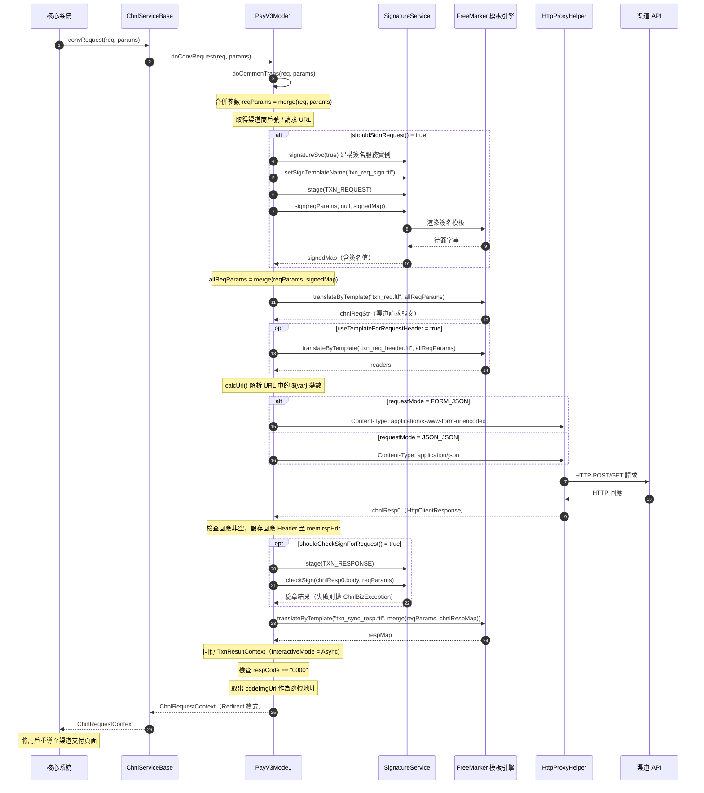
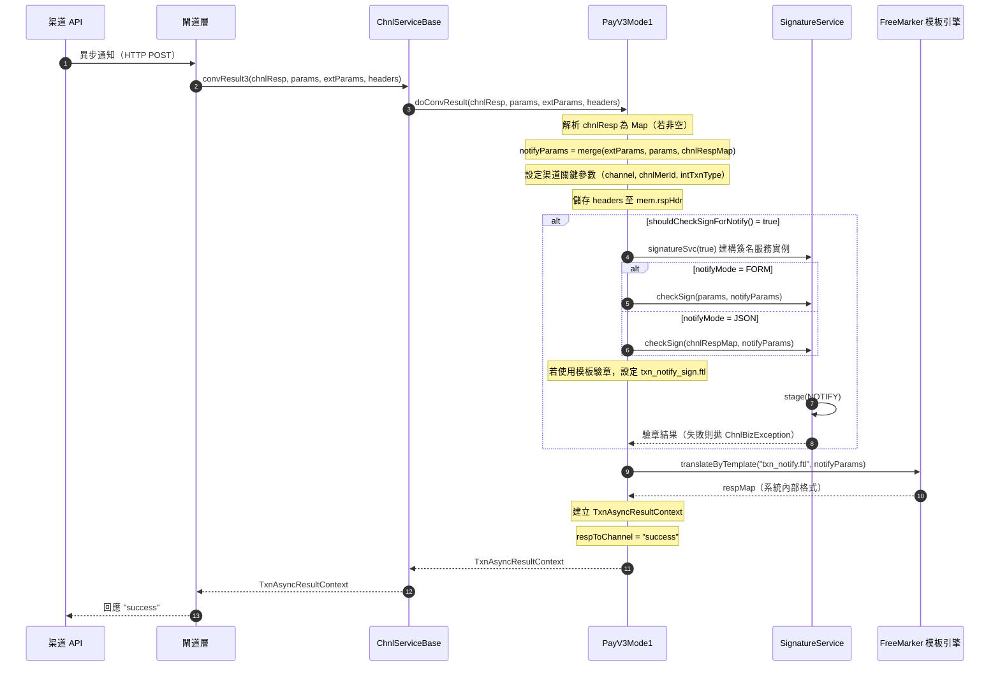
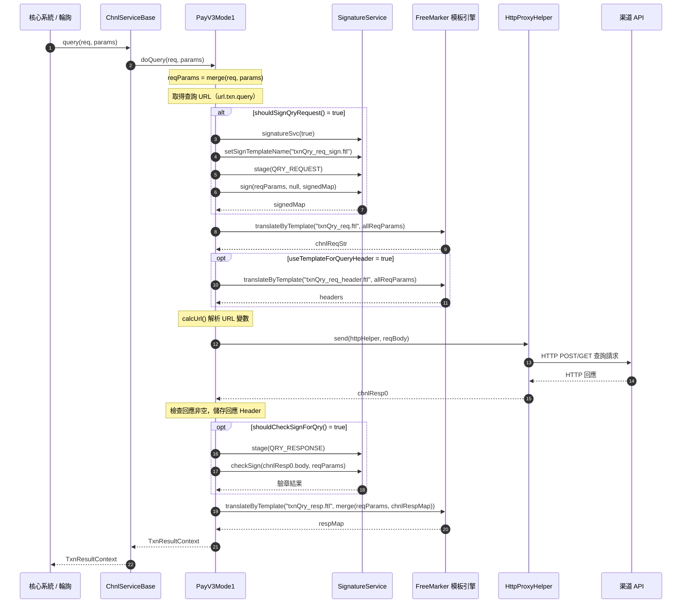

# PayV3Mode1 交互模式順序圖

`com.icpay.payment.service.channel.common.PayV3Mode1`

PayV3Mode1 繼承自 `MyChnlBaseV2 → ChnlServiceBase`，屬於 **Mode1（服務端完整交互模式）**，由服務自行完成與渠道的 HTTP 交互，最終回傳跳轉指令（Redirect）給前端。

---

## 1. 支付請求流程

## 2. 異步通知（回調）處理流程

## 3. 交易查詢流程

---

## 角色對照表

| 順序圖角色 | 完整類別名稱 |
|-----------|-------------|
| 核心系統 | `com.icpay.payment.service.OnlTxnChnlServiceEx`（介面，由核心系統呼叫） |
| ChnlServiceBase | `com.icpay.payment.common.utils.ChnlServiceBase` |
| PayV3Mode1 | `com.icpay.payment.service.channel.common.PayV3Mode1` |
| SignatureService | `com.icpay.payment.common.utils.ChnlSignatureServiceBase`（抽象基類，實際由 `extConfig.signatureService` 指定具體實作） |
| FreeMarker 模板引擎 | `com.icpay.payment.common.utils.ChnlBaseTools.translateByTemplate()` 驅動，模板位於 `templates/chnlTemplate/{渠道代碼}/` |
| HttpProxyHelper | `com.icpay.payment.service.HttpProxyHelper` |
| 閘道層 | `com.icpay.payment.gateway`（閘道 Servlet，負責接收渠道異步通知並分派至對應服務） |
| 渠道 API | 外部第三方支付渠道 HTTP 端點 |

---

## 重點說明

### 架構定位

| 項目 | 說明 |
|------|------|
| **類別** | `PayV3Mode1 → MyChnlBaseV2 → ChnlServiceBase → ChnlBaseTools` |
| **模式** | Mode1 — 服務端完成完整 HTTP 交互，不須系統代發請求 |
| **交互結果** | 支付請求回傳 `Redirect`（跳轉至渠道支付頁），後續由渠道異步通知結果 |

### 三大交互階段

| 階段 | 入口方法 | 核心實作 | 使用模板 |
|------|----------|----------|----------|
| **支付請求** | `convRequest()` | `doConvRequest()` → `doCommonTrans()` | `txn_req_sign.ftl` → `txn_req.ftl` → `txn_sync_resp.ftl` |
| **異步通知** | `convResult3()` | `doConvResult()` | `txn_notify_sign.ftl`（可選）→ `txn_notify.ftl` |
| **交易查詢** | `query()` | `doQuery()` | `txnQry_req_sign.ftl` → `txnQry_req.ftl` → `txnQry_resp.ftl` |

### V3 版本特性（相較 V2）

1. **Header 簽名支援**：簽名值可置入 HTTP Header（如 JWT Bearer Token），透過 `mem.reqHdr` / `mem.rspHdr` 在模板間傳遞
2. **JWT 支援**：搭配 `SignatureV2ForJwt` 簽名服務，支援 JWT Payload 透過 `mem.jwtBody` 存取
3. **URL 變數替換**：請求 URL 支援 `${var}` 語法，由 `calcUrl()` 從報文參數中解析替換
4. **模板前綴機制**：透過 `extConfig.templateNamePrefix` 讓不同交易類型使用不同模板集

### 配置驅動的開關控制

所有簽名/驗章行為由 `MerParams` 資料庫參數控制，預設值如下：

| 參數 | 預設值 | 作用 |
|------|--------|------|
| `sign.action.req.sign` | `1`（啟用） | 支付請求是否簽名 |
| `sign.action.resp.check` | `0`（停用） | 同步回應是否驗章 |
| `sign.action.resp.check.by.template` | `0`（停用） | 驗章是否使用模板 |
| `sign.action.notify.check` | `1`（啟用） | 異步通知是否驗章 |
| `sign.action.notify.check.by.template` | `0`（停用） | 通知驗章是否使用模板 |
| `sign.action.qry.sign` | `1`（啟用） | 查詢請求是否簽名 |
| `sign.action.qry.check` | `1`（啟用） | 查詢回應是否驗章 |

### extConfig 靜態配置

| 參數 | 預設值 | 說明 |
|------|--------|------|
| `requestMode` | `FORM_JSON` | 請求格式：`FORM_JSON`（表單）或 `JSON_JSON`（JSON） |
| `notifyMode` | `FORM` | 異步通知格式：`FORM`（表單）或 `JSON` |
| `signatureService` | （必填） | 簽名服務類別全名 |
| `chnlReqMethod` | `POST` | HTTP 方法：`GET` 或 `POST` |
| `useTemplateForRequestHeader` | `0` | 是否用模板組裝交易請求 Header |
| `useTemplateForQueryHeader` | `0` | 是否用模板組裝查詢請求 Header |
| `templateNamePrefix` | `""` | 模板名稱前綴，用於區隔不同交易類型的模板集 |
| `trimTemplate` | `false` | 是否去除模板輸出的首尾空白 |

### FreeMarker 模板上下文（mem）

模板中可透過 `svc`（即 PayV3Mode1 實例本身）存取工具方法，`mem` Map 中可用的 key：

| Key | 說明 | 寫入時機 |
|-----|------|----------|
| `mem.sgSrc` | 計算後的待簽內容（Map） | 簽名服務寫入 |
| `mem.reqHdr` | 請求 Header（Map） | `doCommonTrans` / `doQuery` 中 assign |
| `mem.rspHdr` | 回應 Header（Map） | 收到渠道回應後 assign |
| `mem.jwtBody` | JWT Payload（Map） | JWT 簽名服務寫入 |
