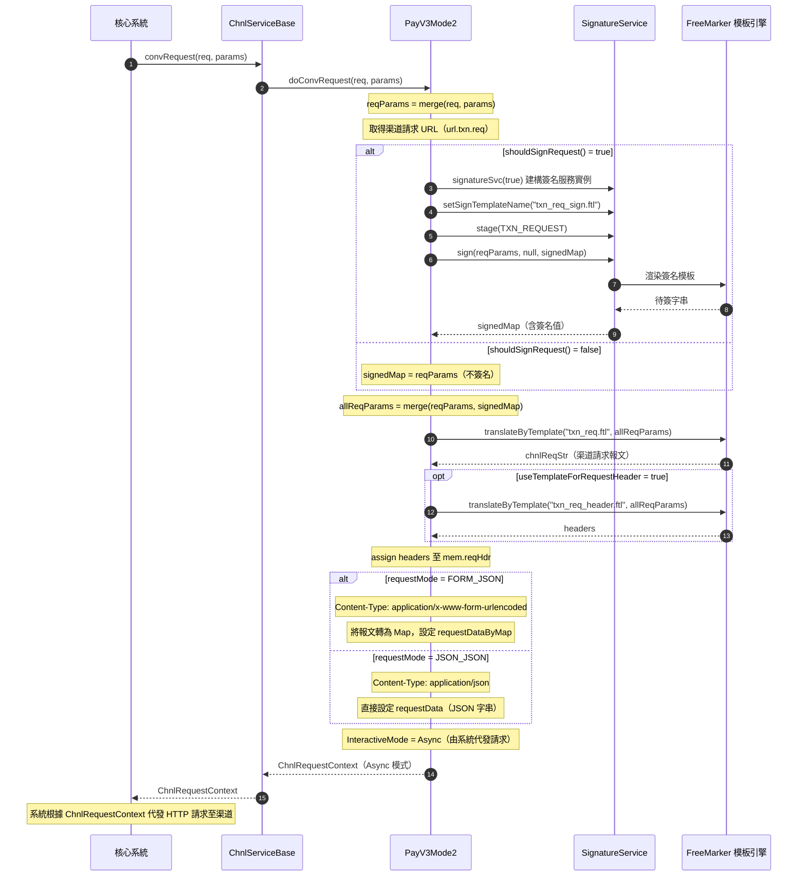
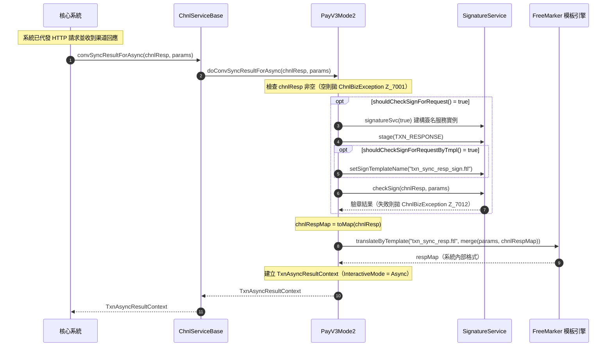
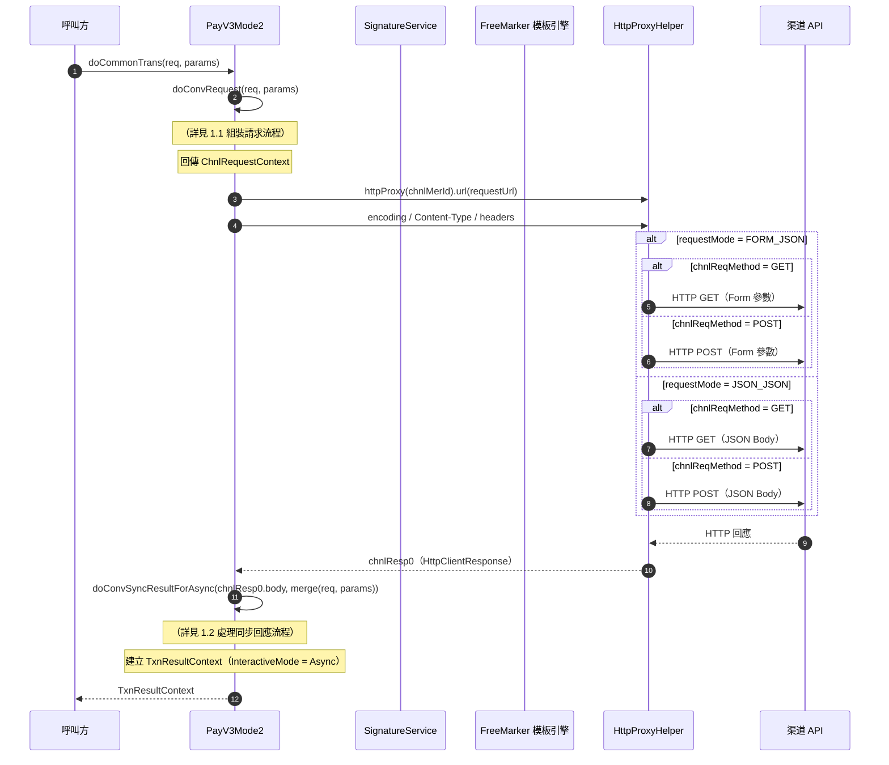
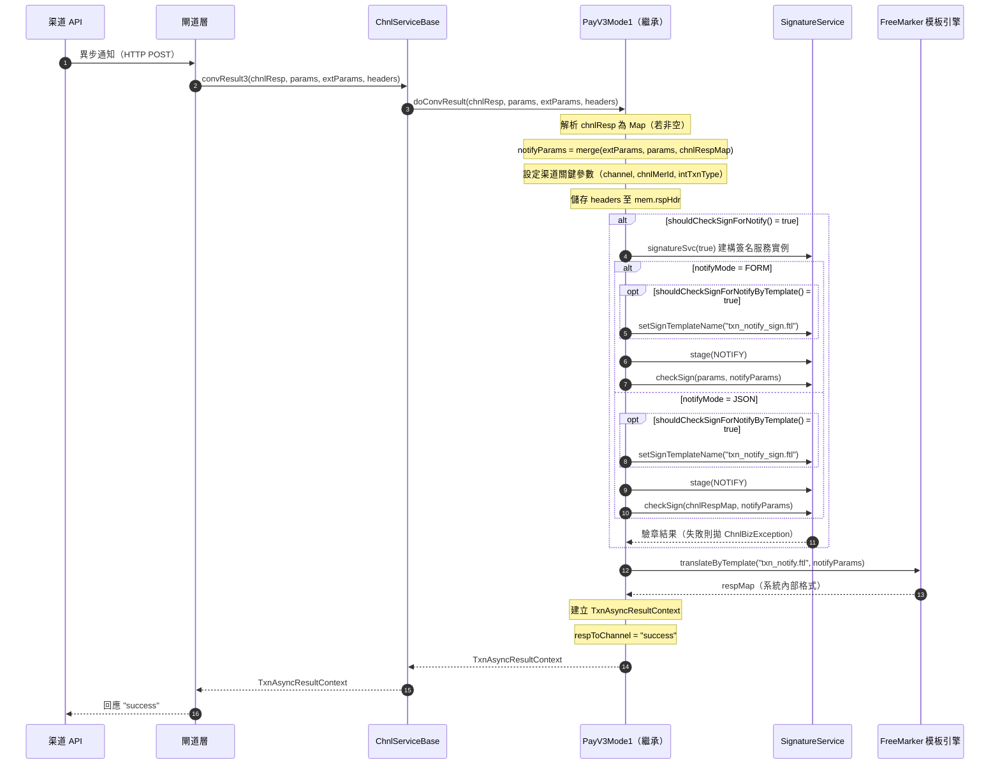
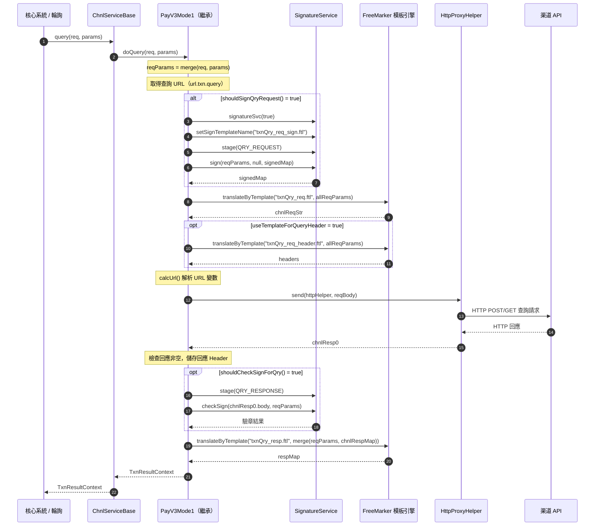

# PayV3Mode2 交互模式順序圖

`com.icpay.payment.service.channel.common.PayV3Mode2`

PayV3Mode2 繼承自 `PayV3Mode1 → MyChnlBaseV2 → ChnlServiceBase`，屬於 **Mode2（兩段式交互模式）**。與 Mode1 不同，Mode2 的支付請求分為兩個階段：服務先組裝請求（`doConvRequest`），由系統代發 HTTP 請求，再由服務處理同步回應（`doConvSyncResultForAsync`）。此外，`doCommonTrans` 方法也可將兩階段合併為一步完成。

異步通知（`doConvResult`）與交易查詢（`doQuery`）流程繼承自 PayV3Mode1，未覆寫。

---

## 1. 支付請求流程（兩段式）

### 1.1 第一階段：組裝請求（doConvRequest）

系統呼叫 `convRequest()` 時，PayV3Mode2 組裝渠道請求報文並回傳 `ChnlRequestContext`（InteractiveMode = **Async**），由系統代為發送 HTTP 請求。

### 1.2 第二階段：處理同步回應（doConvSyncResultForAsync）

系統代發 HTTP 請求後，將渠道的同步回應交由 `doConvSyncResultForAsync` 處理。

### 1.3 合併模式：doCommonTrans（服務端完整交互）

`doCommonTrans` 將兩段式流程合併為一步：服務自行組裝請求、發送 HTTP、處理回應。可由子類或其他方法直接呼叫。

## 2. 異步通知（回調）處理流程

繼承自 PayV3Mode1，流程不變。

## 3. 交易查詢流程

繼承自 PayV3Mode1，流程不變。

---

## Mode1 vs Mode2 對比

| 項目 | PayV3Mode1（Mode1） | PayV3Mode2（Mode2） |
|------|---------------------|---------------------|
| **交互模式** | 服務端完整交互 | 兩段式交互 |
| **doConvRequest** | 呼叫 `doCommonTrans` 完成 HTTP 交互，回傳 **Redirect** | 僅組裝請求報文，回傳 **Async**，由系統代發 |
| **doConvSyncResultForAsync** | 回傳 `null`（不需要） | 處理系統代發後的渠道同步回應 |
| **doCommonTrans** | 組裝 → 發送 HTTP → 解析回應（一步完成） | 覆寫：組裝 → 發送 HTTP → 解析回應（一步完成，供內部使用） |
| **InteractiveMode** | `Redirect`（跳轉） | `Async`（異步等待結果） |
| **異步通知** | 繼承 PayV3Mode1 | 繼承 PayV3Mode1（相同） |
| **交易查詢** | 自行實作 | 繼承 PayV3Mode1（相同） |

---

## 角色對照表

| 順序圖角色 | 完整類別名稱 |
|-----------|-------------|
| 核心系統 | `com.icpay.payment.service.OnlTxnChnlServiceEx`（介面，由核心系統呼叫） |
| ChnlServiceBase | `com.icpay.payment.common.utils.ChnlServiceBase` |
| PayV3Mode2 | `com.icpay.payment.service.channel.common.PayV3Mode2` |
| PayV3Mode1（繼承） | `com.icpay.payment.service.channel.common.PayV3Mode1`（異步通知與查詢邏輯） |
| SignatureService | `com.icpay.payment.common.utils.ChnlSignatureServiceBase`（抽象基類，實際由 `extConfig.signatureService` 指定具體實作） |
| FreeMarker 模板引擎 | `com.icpay.payment.common.utils.ChnlBaseTools.translateByTemplate()` 驅動，模板位於 `templates/chnlTemplate/{渠道代碼}/` |
| HttpProxyHelper | `com.icpay.payment.service.HttpProxyHelper` |
| 閘道層 | `com.icpay.payment.gateway`（閘道 Servlet，負責接收渠道異步通知並分派至對應服務） |
| 渠道 API | 外部第三方支付渠道 HTTP 端點 |

---

## 重點說明

### 架構定位

| 項目 | 說明 |
|------|------|
| **類別** | `PayV3Mode2 → PayV3Mode1 → MyChnlBaseV2 → ChnlServiceBase → ChnlBaseTools` |
| **模式** | Mode2 — 兩段式交互，服務組裝請求交由系統發送，再由服務處理回應 |
| **交互結果** | 支付請求回傳 `Async`（系統代發 HTTP 請求，非跳轉），後續由渠道異步通知結果 |

### 覆寫方法與繼承關係

| 方法 | 來源 | 說明 |
|------|------|------|
| `doConvRequest()` | **PayV3Mode2 覆寫** | 組裝請求報文，InteractiveMode = Async |
| `doConvSyncResultForAsync()` | **PayV3Mode2 覆寫** | 處理渠道同步回應（驗章 + 模板轉換） |
| `doCommonTrans()` | **PayV3Mode2 覆寫** | 合併兩段式流程：組裝 → HTTP → 回應處理 |
| `doConvResult()` | PayV3Mode1 繼承 | 異步通知處理 |
| `doQuery()` | PayV3Mode1 繼承 | 交易查詢 |

### 使用到的模板

| 階段 | 模板 | 說明 |
|------|------|------|
| **支付請求** | `txn_req_sign.ftl` | 交易請求簽名 |
| | `txn_req.ftl` | 交易請求報文（簽名完成後） |
| | `txn_req_header.ftl` | 請求 Header（可選） |
| **同步回應** | `txn_sync_resp_sign.ftl` | 同步回應驗章（可選） |
| | `txn_sync_resp.ftl` | 同步回應解析 |
| **異步通知** | `txn_notify_sign.ftl` | 通知驗章（可選） |
| | `txn_notify.ftl` | 通知報文轉換 |
| **交易查詢** | `txnQry_req_sign.ftl` | 查詢請求簽名 |
| | `txnQry_req.ftl` | 查詢請求報文 |
| | `txnQry_req_header.ftl` | 查詢請求 Header（可選） |
| | `txnQry_resp_sign.ftl` | 查詢回應驗章（可選） |
| | `txnQry_resp.ftl` | 查詢回應解析 |

### 配置驅動的開關控制

所有簽名/驗章行為由 `MerParams` 資料庫參數控制，預設值如下：

| 參數 | 預設值 | 作用 |
|------|--------|------|
| `sign.action.req.sign` | `1`（啟用） | 支付請求是否簽名 |
| `sign.action.resp.check` | `0`（停用） | 同步回應是否驗章 |
| `sign.action.resp.check.by.template` | `0`（停用） | 驗章是否使用模板 |
| `sign.action.notify.check` | `1`（啟用） | 異步通知是否驗章 |
| `sign.action.notify.check.by.template` | `0`（停用） | 通知驗章是否使用模板 |
| `sign.action.qry.sign` | `1`（啟用） | 查詢請求是否簽名 |
| `sign.action.qry.check` | `1`（啟用） | 查詢回應是否驗章 |
| `sign.action.qry.check.by.template` | `0`（停用） | 查詢驗章是否使用模板 |

### extConfig 靜態配置

| 參數 | 預設值 | 說明 |
|------|--------|------|
| `requestMode` | `FORM_JSON` | 請求格式：`FORM_JSON`（表單）或 `JSON_JSON`（JSON） |
| `notifyMode` | `FORM` | 異步通知格式：`FORM`（表單）或 `JSON` |
| `signatureService` | （必填） | 簽名服務類別全名 |
| `chnlReqMethod` | `POST` | HTTP 方法：`GET` 或 `POST` |
| `useTemplateForRequestHeader` | `0` | 是否用模板組裝交易請求 Header |
| `useTemplateForQueryHeader` | `0` | 是否用模板組裝查詢請求 Header |
| `templateNamePrefix` | `""` | 模板名稱前綴，用於區隔不同交易類型的模板集 |
| `trimTemplate` | `false` | 是否去除模板輸出的首尾空白 |
