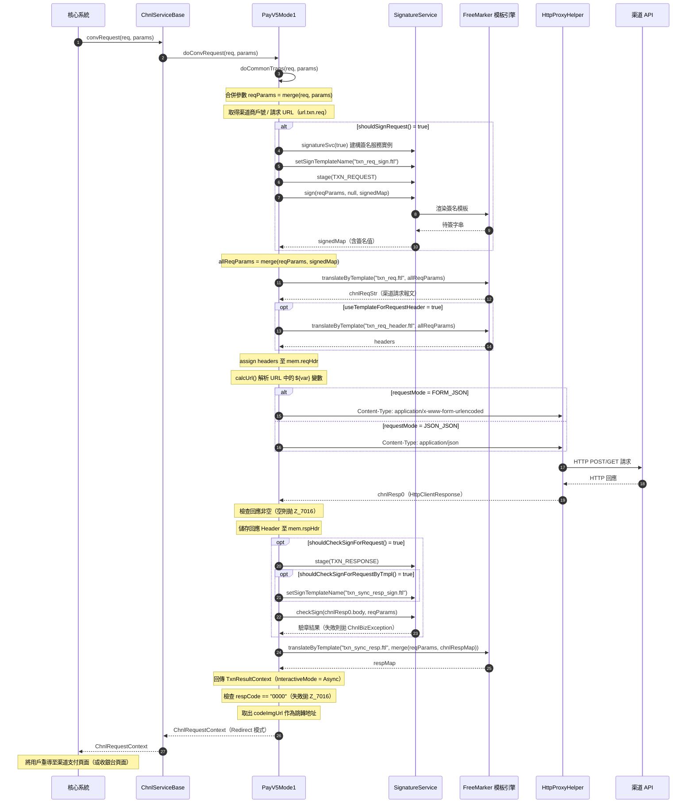
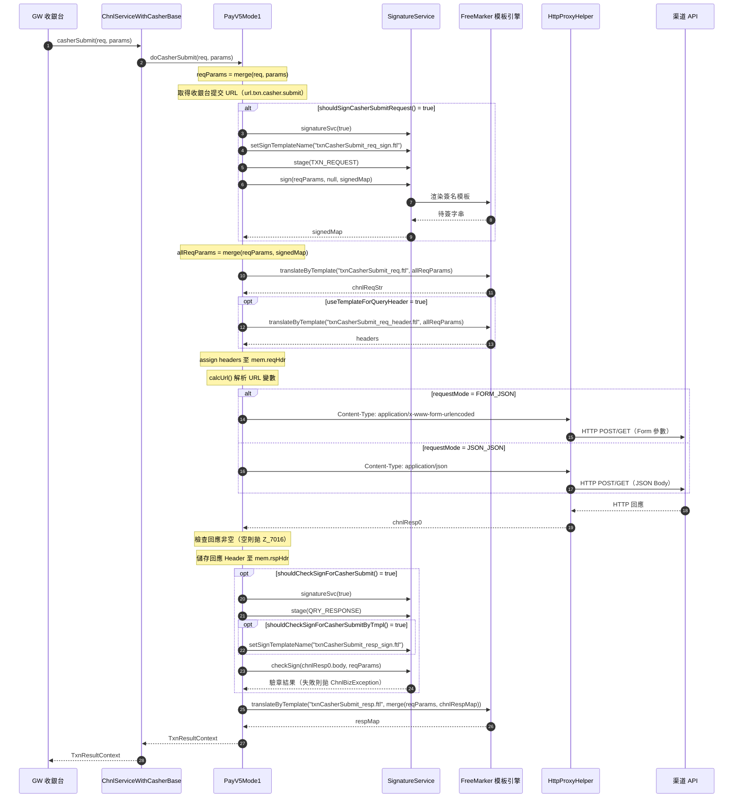
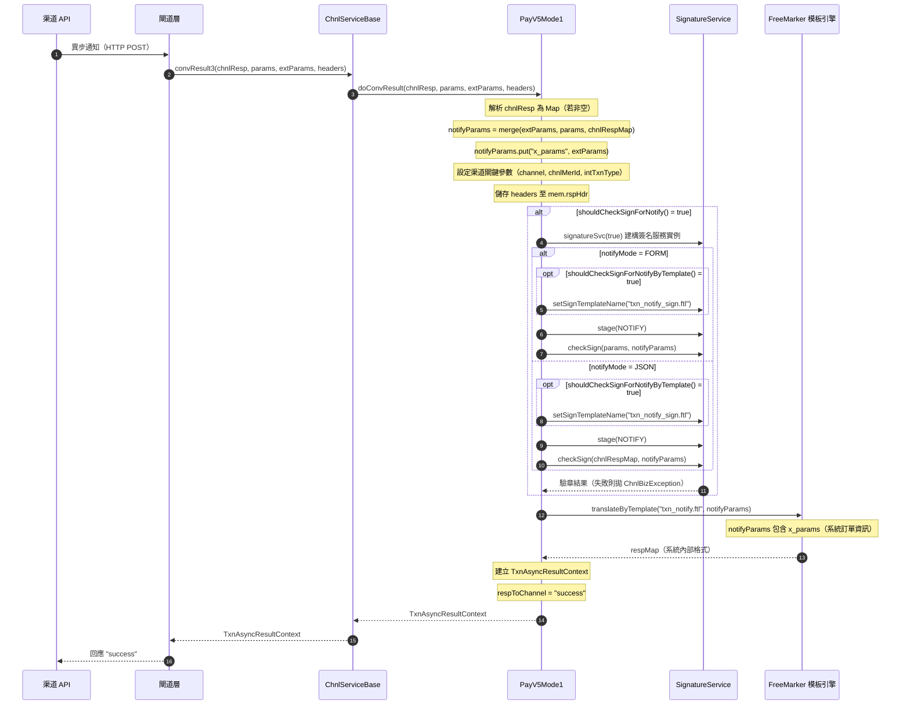
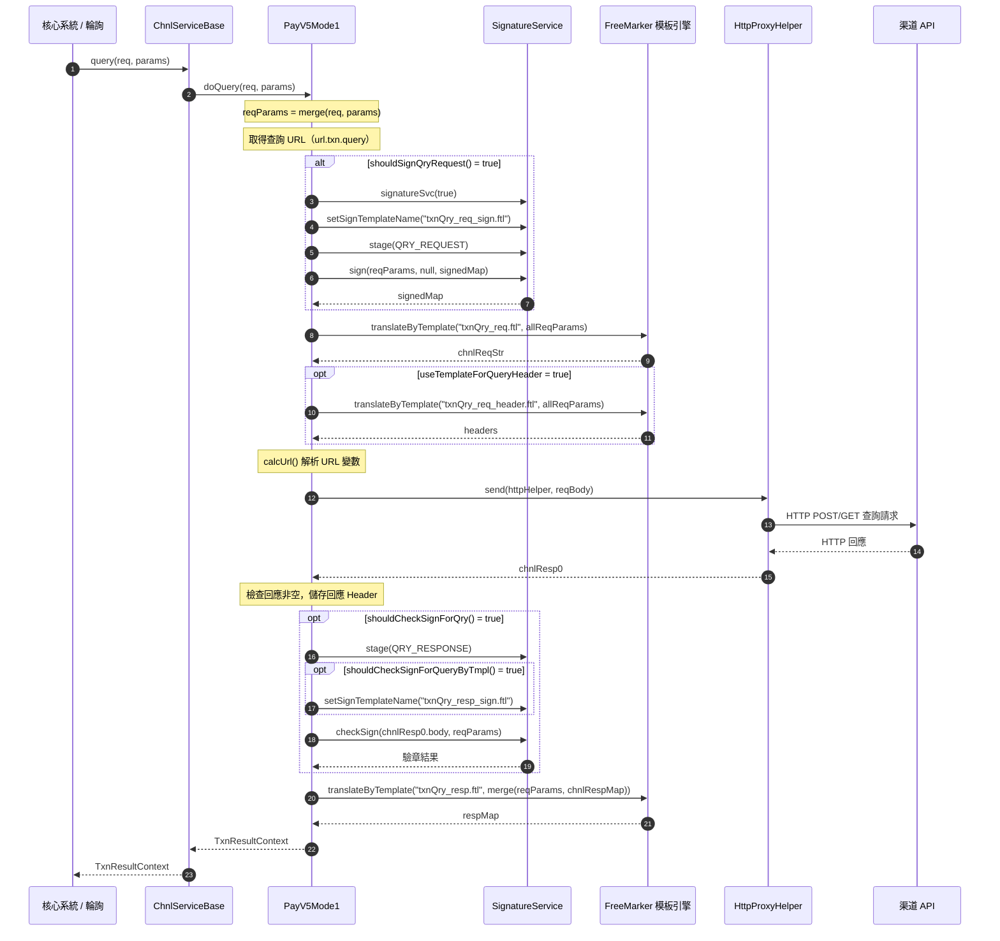
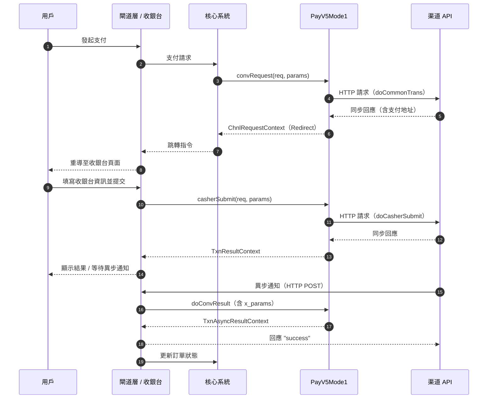

# PayV5Mode1 交互模式順序圖

`com.icpay.payment.service.channel.common.PayV5Mode1`

PayV5Mode1 繼承自 `MyChnlBaseV5 → ChnlServiceWithCasherBase → ChnlServiceBase`，屬於 **Mode1（服務端完整交互模式）**，由服務自行完成與渠道的 HTTP 交互，最終回傳跳轉指令（Redirect）給前端。

相較 PayV3Mode1，V5 版本的關鍵增強：
1. **收銀台提交**：新增 `doCasherSubmit()` 方法，支援 GW 收銀台 submit 後的二次渠道交互
2. **異步通知增強**：`doConvResult()` 模板上下文中新增 `x_params` 字段，存放系統原始訂單資訊
3. **繼承體系**：透過 `ChnlServiceWithCasherBase` 實現 `OnlTxnCasherService` 介面

---

## 1. 支付請求流程



註： 如果需要自定義收銀台的支援， `txn_sync_resp.ftl` 模板中通常需要調用 `svc.getCasherUrl()` 來將必要的渠道端響應的字段內容傳給系統，並計算收銀台地址。

`txn_sync_resp.ftl` 範例：

```freemarker
<#assign casherUrl>${svc.getCasherUrl(ctx, 
  'ch_accountName', (ctx.data.payData.accountName)!'', 
  'ch_account', (ctx.data.payData.account)!'', 
  'ch_bankName', (ctx.data.payData.bankName)!'', 
  'ch_qrcode', (ctx.data.payData.qrcode)!'', 
  'ch_expired', (ctx.data.payData.expired?c)!'', 
  'ch_remark', (ctx.data.payData.remark)!'', 
  'currentLang', 'vn')}</#assign>

{
  "channel": "${svc.getChannel()}",
  "intTxnType" : "${svc.getIntTxnType()!''}",
  "chnlMerId" : "${svc.getChnlMerId()!''}",
  "chnlOrderId" : "${ctx.chnlOrderId!''}",
  "codeImgUrl" : "${casherUrl!''}",
  "codePageUrl" : "${casherUrl!''}",
  "txnStatus" : "01",
  "txnStatusDesc" : "In processing",
  "respCode" : "0000",
  "respMsg" : "OK"
}
```


## 2. 收銀台提交流程（V5 新增）

當用戶在 GW 收銀台頁面填寫資訊並 submit 後，系統呼叫 `casherSubmit()` 執行二次渠道交互。此流程結構與交易查詢類似，使用獨立的模板集與簽名開關。



## 3. 異步通知（回調）處理流程

與 PayV3Mode1 相比，V5 版本在模板上下文中新增了 `x_params` 字段，存放系統原始訂單的重要資訊（渠道編號、交易類型、渠道訂單號、渠道商戶號等），供模板使用。



## 4. 交易查詢流程



---

## 完整交互流程概覽（含收銀台場景）



---

## PayV3Mode1 vs PayV5Mode1 對比

| 項目 | PayV3Mode1 | PayV5Mode1 |
|------|-----------|-----------|
| **繼承體系** | `MyChnlBaseV2 → ChnlServiceBase` | `MyChnlBaseV5 → ChnlServiceWithCasherBase → ChnlServiceBase` |
| **收銀台提交** | 不支援 | 支援 `doCasherSubmit()`，實現 `OnlTxnCasherService` 介面 |
| **異步通知 x_params** | 無 | `notifyParams.put("x_params", extParams)` — 模板可存取系統訂單資訊 |
| **錯誤碼** | `Z_7015`（渠道返回錯誤） | `Z_7016`（渠道返回錯誤 / 報文為空） |
| **支付請求** | 相同流程 | 相同流程 |
| **交易查詢** | 相同流程 | 相同流程 |

---

## 角色對照表

| 順序圖角色 | 完整類別名稱 |
|-----------|-------------|
| 核心系統 | `com.icpay.payment.service.OnlTxnChnlServiceEx`（介面，由核心系統呼叫） |
| ChnlServiceBase | `com.icpay.payment.common.utils.ChnlServiceBase` |
| ChnlServiceWithCasherBase | `com.icpay.payment.common.utils.ChnlServiceWithCasherBase`（新增 `casherSubmit` 入口） |
| PayV5Mode1 | `com.icpay.payment.service.channel.common.PayV5Mode1` |
| MyChnlBaseV5 | `com.icpay.payment.service.channel.common.MyChnlBaseV5`（V5 基礎類） |
| SignatureService | `com.icpay.payment.common.utils.ChnlSignatureServiceBase`（抽象基類，實際由 `extConfig.signatureService` 指定具體實作） |
| FreeMarker 模板引擎 | `com.icpay.payment.common.utils.ChnlBaseTools.translateByTemplate()` 驅動，模板位於 `templates/chnlTemplate/{渠道代碼}/` |
| HttpProxyHelper | `com.icpay.payment.service.HttpProxyHelper` |
| GW 收銀台 | `com.icpay.payment.gateway`（閘道 Servlet，含收銀台頁面） |
| 渠道 API | 外部第三方支付渠道 HTTP 端點 |

---

## 重點說明

### 架構定位

| 項目 | 說明 |
|------|------|
| **類別** | `PayV5Mode1 → MyChnlBaseV5 → ChnlServiceWithCasherBase → ChnlServiceBase → ChnlBaseTools` |
| **模式** | Mode1 — 服務端完成完整 HTTP 交互，不須系統代發請求 |
| **交互結果** | 支付請求回傳 `Redirect`（跳轉至渠道支付/收銀台頁面），後續可能有收銀台提交與異步通知 |

### 四大交互階段

| 階段 | 入口方法 | 核心實作 | 使用模板 |
|------|----------|----------|----------|
| **支付請求** | `convRequest()` | `doConvRequest()` → `doCommonTrans()` | `txn_req_sign.ftl` → `txn_req.ftl` → `txn_sync_resp.ftl` |
| **收銀台提交** | `casherSubmit()` | `doCasherSubmit()` | `txnCasherSubmit_req_sign.ftl` → `txnCasherSubmit_req.ftl` → `txnCasherSubmit_resp.ftl` |
| **異步通知** | `convResult3()` | `doConvResult()` | `txn_notify_sign.ftl`（可選）→ `txn_notify.ftl` |
| **交易查詢** | `query()` | `doQuery()` | `txnQry_req_sign.ftl` → `txnQry_req.ftl` → `txnQry_resp.ftl` |

### 使用到的模板

| 階段 | 模板 | 說明 |
|------|------|------|
| **支付請求** | `txn_req_sign.ftl` | 交易請求簽名 |
| | `txn_req.ftl` | 交易請求報文 |
| | `txn_req_header.ftl` | 請求 Header（可選） |
| | `txn_sync_resp_sign.ftl` | 同步回應驗章（可選） |
| | `txn_sync_resp.ftl` | 同步回應解析 |
| **收銀台提交** | `txnCasherSubmit_req_sign.ftl` | 收銀台提交簽名 |
| | `txnCasherSubmit_req.ftl` | 收銀台提交報文 |
| | `txnCasherSubmit_req_header.ftl` | 提交請求 Header（可選） |
| | `txnCasherSubmit_resp_sign.ftl` | 提交回應驗章（可選） |
| | `txnCasherSubmit_resp.ftl` | 提交回應解析 |
| **異步通知** | `txn_notify_sign.ftl` | 通知驗章（可選） |
| | `txn_notify.ftl` | 通知報文轉換（可存取 `x_params`） |
| **交易查詢** | `txnQry_req_sign.ftl` | 查詢請求簽名 |
| | `txnQry_req.ftl` | 查詢請求報文 |
| | `txnQry_req_header.ftl` | 查詢請求 Header（可選） |
| | `txnQry_resp_sign.ftl` | 查詢回應驗章（可選） |
| | `txnQry_resp.ftl` | 查詢回應解析 |

### 配置驅動的開關控制

所有簽名/驗章行為由 `MerParams` 資料庫參數控制：

| 參數 | 預設值 | 作用 |
|------|--------|------|
| `sign.action.req.sign` | `1`（啟用） | 支付請求是否簽名 |
| `sign.action.resp.check` | `0`（停用） | 同步回應是否驗章 |
| `sign.action.resp.check.by.template` | `0`（停用） | 驗章是否使用模板 |
| `sign.action.notify.check` | `1`（啟用） | 異步通知是否驗章 |
| `sign.action.notify.check.by.template` | `0`（停用） | 通知驗章是否使用模板 |
| `sign.action.qry.sign` | `1`（啟用） | 查詢請求是否簽名 |
| `sign.action.qry.check` | `1`（啟用） | 查詢回應是否驗章 |
| `sign.action.qry.check.by.template` | `0`（停用） | 查詢驗章是否使用模板 |
| `sign.action.casherSubmit.sign` | `1`（啟用） | 收銀台提交是否簽名 |
| `sign.action.casherSubmit.check` | `0`（停用） | 收銀台提交回應是否驗章 |
| `sign.action.casherSubmit.check.by.template` | `0`（停用） | 收銀台提交驗章是否使用模板 |

### 使用到的 MerParams URL 參數

| 參數 | 說明 |
|------|------|
| `url.txn.req` | 交易請求地址 |
| `url.txn.query` | 交易查詢地址 |
| `url.txn.casher.submit` | 收銀台提交地址（V5 新增） |

### extConfig 靜態配置

| 參數 | 預設值 | 說明 |
|------|--------|------|
| `requestMode` | `FORM_JSON` | 請求格式：`FORM_JSON`（表單）或 `JSON_JSON`（JSON） |
| `notifyMode` | `FORM` | 異步通知格式：`FORM`（表單）或 `JSON` |
| `signatureService` | （必填） | 簽名服務類別全名 |
| `chnlReqMethod` | `POST` | HTTP 方法：`GET` 或 `POST` |
| `useTemplateForRequestHeader` | `0` | 是否用模板組裝交易請求 Header |
| `useTemplateForQueryHeader` | `0` | 是否用模板組裝查詢/收銀台提交請求 Header |
| `templateNamePrefix` | `""` | 模板名稱前綴 |
| `trimTemplate` | `false` | 是否去除模板輸出的首尾空白 |

### FreeMarker 模板上下文（mem）

| Key | 說明 | 寫入時機 |
|-----|------|----------|
| `mem.sgSrc` | 計算後的待簽內容（Map） | 簽名服務寫入 |
| `mem.reqHdr` | 請求 Header（Map） | 各流程中 assign |
| `mem.rspHdr` | 回應 Header（Map） | 收到渠道回應後 assign |
| `mem.jwtBody` | JWT Payload（Map） | JWT 簽名服務寫入 |

### 異步通知模板上下文（V5 增強）

| Key | 說明 |
|-----|------|
| `x_params` | `extParams` 的完整內容，包含系統原始訂單的重要資訊（渠道編號、交易類型、渠道訂單號、渠道商戶號等） |
